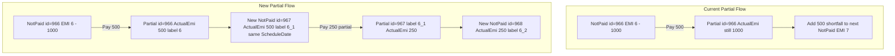

# Partial Payment Implementation Plan

**Project:** MicroCredit (Recovery Posting — Partial Payment split)  
**Frontend repo:** `MicroCredit.Web` (this project)  
**Backend repo:** `../../API/MicroCredit.Service` (sibling to `First/`)  
**Status:** Implementation in progress

---

## Context

**Current behavior** (`../../API/MicroCredit.Service/MicroCredit.Application/Services/RecoveryPostingService.cs`):

- Partial payment updates the same row via `ApplyPartialRecoveryPaymentAsync` (sets `PaymentAmount` / `PrincipalAmount` / `InterestAmount`, status `Partial`; does **not** shrink `ActualEmiAmount`)
- Remainder is carried to the **next unpaid** EMI via `AddCarryForwardToScheduleAsync`

**Target behavior** (confirmed decisions):

- Parent row: `ActualEmiAmount` = paid amount, status `Partial`, P/I/Saving recalculated proportionally
- New child row: `Not Paid`, remainder amounts, **same `ScheduleDate` as parent**
- Sub-installment identity: **`ParentLoanSchedulerId` (int FK) + `SubInstallmentSequence` (int)**
- **Unchanged:** ledger creation, full payment, overdue carry-forward, API POST payload shape, integer `LoanSchedulerId` as sole row identifier



---

## Mandatory Design Constraints

These are **requirements**, not suggestions. They must be reflected in every implementation step.

### 1. IDs vs display labels

| Concept | Storage | Example |
|---------|---------|---------|
| Row identity | `LoanSchedulerId` — int identity PK only | `966`, `967`, `968` |
| Base week | `InstallmentNo` — int | `6` |
| Sub-sequence | `SubInstallmentSequence` — int, default `0` | `0`, `1`, `2` |
| Parent link | `ParentLoanSchedulerId` — nullable int FK | `966` points to parent row |
| **Display label** | **Computed only** — never persisted, never used as FK | `"6"`, `"6_1"`, `"6_2"` |

**Forbidden:** storing `"966_1"`, `"6_1"`, or any string suffix in `LoanSchedulerId`, `InstallmentNo`, or any PK/FK column.

**Required:** expose `InstallmentLabel` (or equivalent) in read APIs and FE as:

```text
InstallmentNo + (SubInstallmentSequence > 0 ? "_" + SubInstallmentSequence : "")
```

Helper location (recommended): `LoanSchedulerInstallmentHelper.FormatInstallmentLabel(installmentNo, subInstallmentSequence)` in Domain.

### 2. Reuse existing LoanScheduler creation logic

Do **not** manually construct entities with scattered property assignments in repositories.

**Reuse pattern from** `LoanSchedulerService.GenerateEMIScheduleAsync`:

```csharp
new LoanScheduler(loanId, scheduleDate, paymentAmount: 0, principalAmount: 0, interestAmount: 0,
    installmentNo, createdBy, actualEmiAmount, actualPrincipalAmount, actualInterestAmount, savingAmount)
```

**Add a domain factory** on `LoanScheduler.cs`, e.g. `LoanScheduler.CreatePartialRemainder(...)`, that:

- Calls the **same constructor** used at loan origination
- Sets `ParentLoanSchedulerId` and `SubInstallmentSequence` after construction
- Sets `Status = NotPaid`, posted amounts = 0

Repository `CreatePartialRemainderSchedulerAsync` must call this factory, then `AddAsync` — not inline property wiring.

### 3. Explicit balance and loan summary verification

Changing parent `ActualEmiAmount` on partial **must** trigger a deliberate review and update of every aggregation that uses scheduler amounts.

Introduce a **single shared calculator** (`LoanSchedulerSummaryCalculator` in Domain) used by `LoanRepository.cs` and verified against reports:

| Metric | Correct formula after partial split |
|--------|-------------------------------------|
| `TotalAmountPaid` | `Sum(PaymentAmount)` where Status is `Paid` or `Partial` |
| `RemainingBal` | `Sum(ActualEmiAmount)` where Status is `NotPaid` (remainder children) |
| `SchedulerTotalAmount` | `Sum(ActualEmiAmount)` across **all** rows — parent (500) + child (500) must still equal original slot due (1000) |
| Terms progress (`paid/total`) | **Total** = count of base rows (`SubInstallmentSequence == 0`); **paid** = base rows with Status `Paid`; **partial** = base rows with Status `Partial`; display `{paid+partial}/{total}` — remainder children do **not** increase term count |

**Verification gate (required before merge):** for a test loan, assert after partial:

- `SchedulerTotalAmount` unchanged vs pre-partial total exposure
- `RemainingBal + TotalAmountPaid` reconciles to schedule exposure
- Manage Loans list, member loan summary, and org summary SQL agree

Files **must** be updated (not just manually tested):

- `MicroCredit.Infrastructure/Repositories/LoanRepository.cs` — both `MapLoanToActiveLoanResponse` and `GetActiveLoansAsync`
- `MicroCredit.Infrastructure/Repositories/ReportRepository.cs` — Member Wise Collection `outstandingWeeks`, `toBeCollected`, `osBalance`
- `MicroCredit.Infrastructure/Database/sp_BranchLoansReport.sql` — include Partial in paid sums; base-term count for denominator

### 4. Recursive partial payments — explicit supported rule

**Supported workflow (same code path for every NotPaid row, including children):**

```text
EMI 6  (SubInstallmentSequence=0)  --partial 500-->  Partial 6 + NotPaid 6_1
EMI 6_1 (sequence=1)               --partial 250-->  Partial 6_1 + NotPaid 6_2
EMI 6_2 (sequence=2)               --pay full-->     Paid 6_2
```

Rules:

- Any **NotPaid** row (base or child) may receive a partial or full payment
- Each partial creates **one** new remainder child with `SubInstallmentSequence = Max(sequence for same LoanId+InstallmentNo) + 1`
- `ParentLoanSchedulerId` on the new child = the row that was just partially paid (immediate parent)
- `InstallmentNo` stays the **base week number** (6) for the entire chain
- Sequential posting: **6_2 must be cleared before EMI 7** — sort key is `(InstallmentNo, SubInstallmentSequence)`

This is **not** an open question. Implementation and tests must cover the 6 → 6_1 → 6_2 chain explicitly.

### 5. Query and count audit — installment ordering and report inflation

Every location below **must** be reviewed and updated where needed. Goal: correct sequence, no double-counting of weeks/terms.

**Ordering standard (all list/query paths):**

```csharp
.OrderBy(ls => ls.InstallmentNo).ThenBy(ls => ls.SubInstallmentSequence)
```

**Counting standard:**

- **Term/week totals:** count base installments only (`SubInstallmentSequence == 0`) unless explicitly counting open remainder slots
- **Outstanding weeks (reports):** count **distinct `InstallmentNo`** that have any `NotPaid` row — not raw `NotPaid` row count
- **Overdue carry-forward target:** next **base** installment only (`SubInstallmentSequence == 0` AND `InstallmentNo > current base week`)

| # | File / location | Audit action |
|---|-----------------|--------------|
| 1 | `RecoveryPostingRepository.cs` — `GetSchedulersAsync` | Add ordering; expose `SubInstallmentSequence` in response |
| 2 | `RecoveryPostingRepository.cs` — `GetNextUnpaidLoanSchedulerIdAsync` | Overdue only: target next **base** installment |
| 3 | `RecoveryPostingRepository.cs` — `GetNextSubInstallmentSequenceAsync` | `Max(SubInstallmentSequence)` where `LoanId + InstallmentNo` match |
| 4 | `LoanSchedulersRepository.cs` — `GetLoanSchedulersByIdAsync` | Order by `(InstallmentNo, SubInstallmentSequence)` |
| 5 | `LoanSchedulersRepository.cs` — `GetFutureUnpaidByPocIdAsync` | Same ordering |
| 6 | `RecoveryPostingService.cs` — post batch ordering | `ThenBy(SubInstallmentSequence)` after `InstallmentNo` |
| 7 | `LoanRepository.cs` | Use `LoanSchedulerSummaryCalculator`; base-term counts only |
| 8 | `ReportRepository.cs` — dashboard/member/staff schedule queries | Ordering + distinct-week outstanding logic |
| 9 | `ReportRepository.cs` — Member Wise Collection aggregation | Fix `outstandingWeeks` to distinct `InstallmentNo` |
| 10 | `ReportRepository.cs` — `GetSummaryAsync` inline SQL | Partial rows use `PaymentAmount`; outstanding uses NotPaid `ActualEmi` |
| 11 | `sp_BranchLoansReport.sql` | Partial in paid sums; term denominator = base installments |
| 12 | `POCService.cs` — schedule shift | Include all unpaid rows in correct order |
| 13 | `LoansService.cs` — claim / close | Pending scheduler sums include remainder children |
| 14 | `src/pages/recoveryPosting/RecoveryPostingList.tsx` | Sequential sort by `(installmentNo, subInstallmentSequence)` |
| 15 | `src/pages/loan/LoanPrepayment.tsx` | Same sort; recursive partial chain in sequential rules |
| 16 | `src/pages/loanScheduler/LoanSchedulerList.tsx` | Display `InstallmentLabel`, not raw ID |
| 17 | `src/services/loanScheduler.service.ts` | Map new API fields |

---

## Architecture

| Layer | Project | Role in this change |
|-------|---------|---------------------|
| API | `MicroCredit.Api` | No POST contract change; read DTOs gain sub-installment fields + `InstallmentLabel` |
| Application | `MicroCredit.Application` | Partial orchestration, `EmiAmountSplitter` |
| Domain | `MicroCredit.Domain` | Entity factory, helpers, summary calculator |
| Infrastructure | `MicroCredit.Infrastructure` | Migration, repository SQL, report fixes |
| Frontend | `MicroCredit.Web` (this repo) | Display label + sequential sort (POST unchanged) |

Transaction model: single EF transaction in `PostRecoveriesAsync` wrapping parent update + child insert + ledger deposits.

---

## Implementation Phases

### Phase 1 — Database schema

Add to `LoanSchedulers`:

| Column | Type | Notes |
|--------|------|-------|
| `ParentLoanSchedulerId` | int NULL | FK → `LoanSchedulers.LoanSchedulerId`, `ON DELETE RESTRICT` |
| `SubInstallmentSequence` | int NOT NULL DEFAULT 0 | 0 = original EMI; 1+ = remainder slot |

Add index: `(LoanId, InstallmentNo, SubInstallmentSequence)`.

### Phase 2 — Shared amount split logic

New file: `MicroCredit.Application/Utilities/EmiAmountSplitter.cs` — mirrors `src/pages/recoveryPosting/recoveryPostingCalculations.ts`.

### Phase 3 — Repository changes

- Extend `ApplyPartialRecoveryPaymentAsync` to set `ActualEmi*` and `SavingAmount` on parent
- Add `CreatePartialRemainderSchedulerAsync` via `LoanScheduler.CreatePartialRemainder` factory
- Add `GetNextSubInstallmentSequenceAsync(loanId, installmentNo)`
- Keep `AddCarryForwardToScheduleAsync` for **Overdue only**

### Phase 4 — Service orchestration

Update `RecoveryPostingService` partial branch: split → update parent → insert child; remove partial carry-forward.

### Phase 5 — Loan summary calculator (required)

Add `LoanSchedulerSummaryCalculator`; integrate into `LoanRepository` and report aggregations.

### Phase 6 — API read paths

Extend `LoanSchedulerResponce` with `ParentLoanSchedulerId`, `SubInstallmentSequence`, `InstallmentLabel`.

### Phase 7 — Frontend (this repo)

- POST payload unchanged
- Render `InstallmentLabel` in schedule/recovery grids
- Sequential validation: sort by `(installmentNo, subInstallmentSequence)`

### Phase 8 — Historical data

Forward-only. Do not auto-migrate legacy carry-forward partials unless separately requested.

### Phase 9 — Testing

| # | Scenario | Expected |
|---|----------|----------|
| 1 | EMI 1000, pay 500 | Parent Partial ActualEmi=500; child NotPaid ActualEmi=500 label 6_1; ledger=500 |
| 2 | Pay remaining 500 on child | Child Paid |
| 3 | Recursive: 6_1 pay 250 partial | Partial 6_1 + NotPaid 6_2 ActualEmi=250 |
| 4 | Partial EMI 6 while 6_1 open, attempt EMI 7 | Blocked |
| 5 | Partial on last base installment | Succeeds — child created |
| 6 | Full payment | No child row |
| 7 | Overdue | Carry-forward to next **base** EMI unchanged |
| 8 | Balance check | `RemainingBal + TotalAmountPaid == SchedulerTotalAmount` |
| 9 | Terms display | `{partial+paid}/{baseTerms}` — children do not increase denominator |
| 10 | Member Wise Collection | `outstandingWeeks` not inflated by 6 + 6_1 |

---

## Implementation checklist

- [x] Schema migration + entity factory + helpers
- [x] `EmiAmountSplitter`
- [x] Repository partial update + child insert (factory-based)
- [x] `RecoveryPostingService` partial branch
- [x] `LoanSchedulerSummaryCalculator` in `LoanRepository`
- [x] Query audit (17 locations in §5 table) — backend + FE display/sort; manual regression pending
- [x] API read DTOs + FE display/sort
- [ ] Regression matrix including balance verification and 6 → 6_1 → 6_2

**Rollback:** DB backup before migration; revert if totals fail verification gate.

---

## Resolved decisions

| Topic | Decision |
|-------|----------|
| Recursive partials (6 → 6_1 → 6_2) | **Supported** |
| Child `ScheduleDate` | **Same as parent** |
| ID format | Integer `LoanSchedulerId` only; `6_1` is display label |
| Entity creation | Reuse constructor via domain factory |
| Partial term counting | Base rows only in `{paid}/{total}` denominator |
| Overdue when parent Partial + child NotPaid | Out of scope for this change |

---

## Related documentation

- [MASTER_INDEX.md](./MASTER_INDEX.md) — WF-06 Recovery Posting, API-15
- [UI_UX_DOCUMENTATION.md](./UI_UX_DOCUMENTATION.md) — §6.21 Recovery Posting, sequential EMI rules
