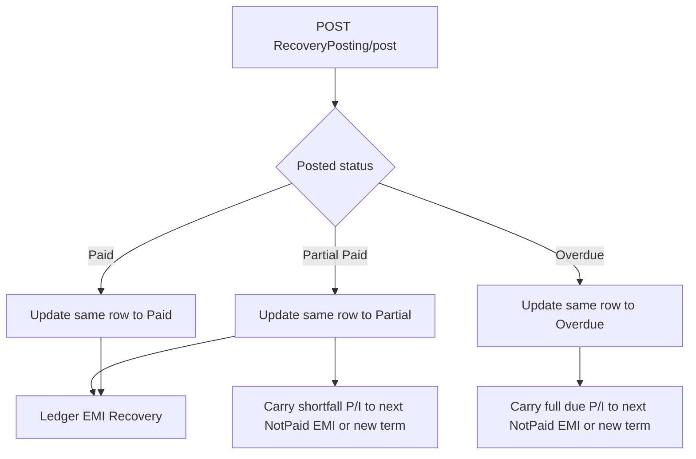
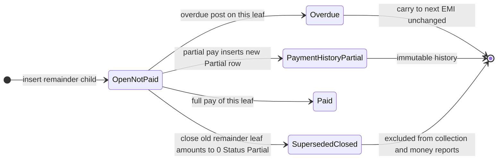

# Partial Payment / Overdue / Recovery — Implemented Design

> Current requirement (supersedes the older remainder-child proposal):
> the original EMI row stores the remaining pending amount and stays `Not Paid`;
> every payment is a separate child transaction. No NotPaid remainder child is created.

## Final partial-payment model

Example: Installment 1 EMI = ₹1,500, staff pays ₹750.

| Row | Actual EMI | Payment | Status | Parent |
|-----|------------|---------|--------|--------|
| Original installment 1 | ₹750 remaining | ₹0 | Not Paid | null |
| New payment child | ₹750 paid slice | ₹750 | Partial | Original ID |

If staff later pays ₹300:

- Original becomes ₹450 and remains `Not Paid`.
- A second Partial child is inserted for ₹300.
- The first child is never changed.
- No NotPaid remainder child is inserted.

When the final ₹450 is paid:

- A final `Paid` child is inserted for ₹450.
- Original Actual amounts become 0 and original status becomes `Paid`.
- Total paid for the EMI is the sum of all child `PaymentAmount` values:
  `750 + 300 + 450 = 1,500`.

For an EMI paid fully in one transaction (without prior payment children), the existing
same-row full-payment behavior remains.

## Overdue

Overdue carry-forward remains exactly as before:

1. Mark the currently pending original EMI `Overdue`.
2. Carry its remaining Actual principal/interest into the next unpaid installment.
3. Create the next term if no later unpaid installment exists.
4. Do not create a ledger entry for Overdue.

Only the old **partial-payment shortfall carry** was removed. Overdue carry-forward was not changed.

## Collection and reporting rules

- Pending/outstanding = original `Not Paid` row's current `Actual*`.
- Collected = sum of child `PaymentAmount` where status is `Partial` or `Paid`.
- Full EMI face value after partials = original remaining Actual + all payment-child amounts.
- Recovery Posting lists the original NotPaid row, not its payment-history children.
- Insurance Claim uses the original remaining amount, not the child payment history.
- Ledger still creates one `EMI Recovery` deposit for each posted payment batch.

## Database fields

- `ParentLoanSchedulerId`: payment child points to the original EMI.
- `SubInstallmentSequence`: orders payment transactions (`1`, `2`, `3`, ...).
- Original row: `ParentLoanSchedulerId = null`, sequence `0`.

## Local verification

1. Pay ₹750 against a ₹1,500 EMI.
2. Confirm one child row only:

```sql
SELECT LoanSchedulerId, ParentLoanSchedulerId, SubInstallmentSequence,
       InstallmentNo, Status, ActualEmiAmount, PaymentAmount
FROM LoanSchedulers
WHERE LoanId = @LoanId AND InstallmentNo = @InstallmentNo
ORDER BY SubInstallmentSequence;
```

Expected after first partial:

- Original: Not Paid, Actual ₹750, Payment ₹0.
- Child sequence 1: Partial, Actual ₹750, Payment ₹750.
- No NotPaid child.

3. Pay another ₹300:
   - Original Actual ₹450, still Not Paid.
   - Child sequence 2: Partial ₹300.
4. Pay final ₹450:
   - Original Actual 0, Paid.
   - Child sequence 3: Paid ₹450.
   - Sum child PaymentAmount = ₹1,500.

---

## Historical planning notes

The sections below document earlier analysis and are retained for audit context.
Where they mention an immutable original or a NotPaid remainder child, the implemented
design above takes precedence.

**Status:** Implementation in progress  
**Last updated:** 2026-08-05

## Phase 0 findings

| Check | Result |
|-------|--------|
| EF entity / config / migrations (pre-change) | **No** `ParentLoanSchedulerId` / `SubInstallmentSequence` |
| Local SQL `dinspire_mcs_dev` from agent host | **Unreachable** (connection timeout) |
| Decision | **Add columns** via idempotent migration `20260805120000_AddLoanSchedulerPartialSubInstallment` + `Database/ApplyPartialPaymentParentChildSchema.sql` |

If a target DB already has the columns, the SQL uses `IF COL_LENGTH` / `IF NOT EXISTS` so re-apply is safe; map-only path is satisfied by the new EF properties.

---

## Overview

Revise partial-payment **LoanScheduler record creation** so the original installment row stays immutable and every partial is a separate history row (parent/child), while **preserving today’s overdue carry-forward behavior unchanged**. Recovery sequential validation must detect whether an overdue balance was already transferred—not blindly ignore `Overdue`.

**No new database columns will be added until Phase 0 verifies** whether `ParentLoanSchedulerId` / `SubInstallmentSequence` already exist on the target SQL database and why they are unmapped in this codebase.

### Approval conditions (locked)

1. **Superseded NotPaid lifecycle** is fully defined in [Superseded NotPaid remainder lifecycle](#superseded-notpaid-remainder-lifecycle) (status transition + exclusion from collection and reporting).
2. **Carry-forward scope** is explicit in [Carry-forward scope — what changes vs what does not](#carry-forward-scope--what-changes-vs-what-does-not): only **partial payment** stop carrying shortfall to the next EMI; **overdue carry-forward remains exactly as today**.

---

## Implementation todos

| ID | Task | Status |
|----|------|--------|
| phase0-db | Verify target SQL DB for ParentLoanSchedulerId / SubInstallmentSequence; document why unmapped; only then decide map vs migrate | pending |
| phase4-validation | Recovery/Modify Loan sequential: block only when earlier installment has untransferred outstanding (smart Overdue check) | pending |
| phase1-schema | Map existing columns or add migration **only after** Phase 0 proof | pending |
| phase2-partial | Partial redesign: original immutable; insert-only Partial + insert NotPaid remainder (Option B); stop partial shortfall carry to next EMI | pending |
| phase3-overdue | Keep existing overdue carry-forward logic as-is (ApplyOverdue + AddCarryForward / CreateNext) | pending |
| phase5-summary | Loan Summary / HasOpenSchedulers / Claim for parent-child + collectible rules | pending |
| phase6-reports-fe | Branch Dashboard, Recovery Reports, scheduler DTOs, FE labels | pending |
| phase7-ledger | Validate all Ledger paths affected (EMI Recovery, Insurance claim, close/skip) | pending |
| phase8-test | Full regression checklist | pending |

---

## Corrections applied to prior plan

| Prior plan | Revised |
|------------|---------|
| Assume add `ParentLoanSchedulerId` / `SubInstallmentSequence` | **Phase 0 first:** inspect target DB; explain unmapped columns; create columns only if missing |
| Change / redesign carry-forward generally | **Do not change overdue carry-forward.** Only change how **partial** LoanScheduler rows are created |
| Optimize by updating leaf to Partial + insert remainder only | **Insert-only payment history.** Every partial = separate Partial transaction row + new NotPaid remainder. Close superseded NotPaid leaf only when architecturally required |
| Recovery: simply ignore Overdue | **Detect carry-forward completion.** Block only if outstanding was **not** transferred |
| Impact mostly Recovery + LoanRepository | **Expand:** Loan Summary, Branch Dashboard, Recovery Reports, Insurance Claim, every Ledger entry touched |

---

## Critical finding: codebase vs sample data

**This repository’s EF model does not map `ParentLoanSchedulerId` or `SubInstallmentSequence`.** Grep across entity, configurations, migrations, and scaffold finds **zero** definitions.

Your sample (`1684 → 29431 → 29432`) implies those columns may exist in a **live SQL database** (manual script, another branch, or undeployed migration) while this solution’s model snapshot never absorbed them.

**Phase 0 is mandatory before any schema work.**

---

## Current behavior (this codebase) — baseline to preserve / change



| Path | Today | After redesign |
|------|-------|----------------|
| Full pay | Same-row Paid | Unchanged |
| Partial | Same-row Partial + **also** carries shortfall P/I onto the **next** installment | **Original untouched**; insert Partial history child + insert NotPaid remainder child on **same** installment. **Partial shortfall is no longer added to the next EMI** (that next-EMI bump was partial-only behavior). |
| Overdue | Same-row Overdue + carry full due to next EMI | **Exactly unchanged** — same methods, same next-EMI / new-term rules, same no-ledger rule |
| Ledger EMI Recovery | Deposit per loan batch for Paid/Partial | Unchanged mechanism; more Partial history rows; same batching |

---

## Carry-forward scope — what changes vs what does not

This section exists so “removing partial carry-forward” cannot be read as changing overdue.

| Mechanism | Code today | After redesign |
|-----------|------------|----------------|
| **Partial → next EMI carry** (`shortfallP/I` → `AddCarryForwardToScheduleAsync` / `EnsureNextCarryForwardScheduleAsync` inside the **partial** branch of `PostRecoveriesAsync`) | Runs after `ApplyPartialRecoveryPaymentAsync` | **Removed from the partial branch only.** Remaining balance is represented by a new same-installment NotPaid child, not by inflating EMI N+1. |
| **Overdue → next EMI carry** (`dueP/I` → same carry helpers inside the **overdue** branch) | Runs after `ApplyOverdueRecoveryAsync` | **Unchanged.** Do not edit overdue-branch carry calls, amount math, next-unpaid lookup, or “create next term” behavior. |
| Shared helpers `AddCarryForwardToScheduleAsync`, `CreateNextCarryForwardScheduleAsync` | Used by both paths | **Remain in the codebase** for overdue (and any other non-partial callers). Partial path simply stops calling them. |

**One-line rule:** Change **how partial payments create LoanScheduler rows**. Do **not** change **overdue carry-forward**.

---

## Superseded NotPaid remainder lifecycle

Uses **existing** `LoanSchedulerStatus` values only (no new enum for MVP).

### Row kinds after redesign

| Kind | How identified | Status | Amounts |
|------|----------------|--------|---------|
| **Base header** | `ParentLoanSchedulerId IS NULL`, `SubInstallmentSequence = 0` | Stays `Not Paid` forever on partials (immutable) | Original Actual* unchanged |
| **Payment history** | Child row created for a collection | `Partial` (or `Paid` if that leaf was paid in full via full-pay path) | `PaymentAmount` / P / I = this transaction; `Actual*` = this transaction’s paid slice |
| **Open remainder** | Child row still due | `Not Paid` | `PaymentAmount = 0`; `Actual*` = outstanding |
| **Superseded remainder** | Former open remainder that was the target of a later partial split | See transition below | Zeroed |
| **Overdue leaf** | Open remainder posted overdue | `Overdue` | Actual* unchanged until/unless product later zeros; carry uses those dues (existing behavior) |

### When a NotPaid remainder is superseded

Applies when posting a **partial** against an **open remainder child** (not the immutable base).

Example: Seq=2 is `Not Paid`, Actual=500. User pays 250.

1. **Insert** payment history: Seq=3, Status=`Partial`, Actual=500? No — Actual/Payment = **250**, Parent = original.
2. **Insert** new open remainder: Seq=4, Status=`Not Paid`, Actual=250, Payment=0, Parent = original.
3. **Close Seq=2 (supersede)** — required so 500 is not collectible twice:

| Field | Value after supersede |
|-------|------------------------|
| `Status` | `Partial` |
| `PaymentAmount` | `0` |
| `PrincipalAmount` | `0` |
| `InterestAmount` | `0` |
| `ActualEmiAmount` | `0` |
| `ActualPrincipalAmount` | `0` |
| `ActualInterestAmount` | `0` |
| `PaymentDate` | UTC now (closure timestamp) |
| `Comments` | Append/set marker e.g. `Superseded` (optional but recommended for audit) |
| `ParentLoanSchedulerId` / `InstallmentNo` / `SubInstallmentSequence` | Unchanged |

**Rationale for Status = `Partial` with all amounts 0:**  
No `Superseded` enum exists. Zero-amount `Partial` is **not** a payment transaction (those have `PaymentAmount > 0`). This update closes the leaf only; it does **not** rewrite payment history (history is the new Seq=3 insert).

**First partial against base:** base is **not** superseded via status change (immutable). Base becomes non-collectible solely because **children exist** (query rule). No amount/status update on base.

**Full pay of an open remainder:** use existing full-pay path on that leaf → Status=`Paid` with payment amounts (that leaf is the payment record; no separate Partial insert required for full settlement of that leaf). No superseded zero-row in that case.

### Exclusion rules (collection and reporting)

Define two predicates used everywhere:

```text
IsPaymentHistory(row) =
  Status IN (Partial, Paid)
  AND PaymentAmount > 0

IsSupersededClosed(row) =
  Status = Partial
  AND PaymentAmount = 0
  AND ActualEmiAmount = 0
  AND ParentLoanSchedulerId IS NOT NULL

IsCollectible(row) =
  Status = NotPaid
  AND ActualEmiAmount > 0
  AND (
    ParentLoanSchedulerId IS NOT NULL
    OR NOT EXISTS (children of this base)
  )

IsOutstandingForReports(row) = IsCollectible(row)

IsCollectedForReports(row) = IsPaymentHistory(row)
  // optionally also Status=Paid with PaymentAmount > 0 already covered
```

| Consumer | Include | Exclude |
|----------|---------|---------|
| Recovery GET / post targets | `IsCollectible` | Base-with-children; `IsSupersededClosed`; Partial/Paid history; Overdue |
| Sequential “untransferred outstanding” | `IsCollectible` on earlier installment | Superseded closed; payment history; Overdue that already carried |
| Loan Summary outstanding | Σ Actual where `IsCollectible` | Superseded; base header Actual after children exist; payment history |
| Loan Summary collected / TotalAmountPaid | Σ PaymentAmount where `IsPaymentHistory` (and Paid) | `IsSupersededClosed` (Pay=0) |
| Branch Dashboard outstanding | Collectible NotPaid Actual (+ Overdue only if product still wants overdue face in outstanding—prefer carry target only to avoid double-count) | Superseded; non-collectible base |
| Branch Dashboard collected | PaymentAmount on payment-history Partial/Paid | Superseded zero Partial |
| Recovery Reports received | Principal/Interest where `IsPaymentHistory` | Superseded zero Partial |
| Recovery Reports outstanding | Actual where `IsCollectible` | Base-with-children; superseded |
| Insurance claim pending | Rows that are `IsCollectible` plus Overdue leaves **not yet carried** (same untransferred rule) | Superseded; payment history; immutable base with children |
| `HasOpenSchedulers` | Any `IsCollectible` (and untransferred overdue if treated as open) | Superseded; payment history; base-with-children NotPaid |
| Member-wise `toBeCollected` | Base face value (Seq=0 Actual) or reconstruct without summing superseded + history + open | Do not Σ all Actual blindly |

### Lifecycle diagram



---

## Phase 0 — Database verification (no feature code)

### Actions

1. Against **target** SQL (dev/staging matching the sample data), run:

```sql
SELECT c.name, t.name AS type_name, c.is_nullable
FROM sys.columns c
JOIN sys.types t ON c.user_type_id = t.user_type_id
WHERE c.object_id = OBJECT_ID(N'dinspire_sa.LoanSchedulers') -- adjust schema
  AND c.name IN (N'ParentLoanSchedulerId', N'SubInstallmentSequence');

SELECT TOP 20 LoanSchedulerId, ParentLoanSchedulerId, InstallmentNo, Status, ActualEmiAmount, PaymentAmount
FROM /* LoanSchedulers */
WHERE ParentLoanSchedulerId IS NOT NULL
ORDER BY LoanSchedulerId DESC;
```

2. Compare to EF:
   - [LoanScheduler.cs](E:/MCS/API/MicroCredit.Service/MicroCredit.Domain/Entities/LoanScheduler.cs)
   - [LoanSchedulerConfiguration.cs](E:/MCS/API/MicroCredit.Service/MicroCredit.Infrastructure/Persistence/Configurations/LoanSchedulerConfiguration.cs)
   - `MicroCreditDbContextModelSnapshot.cs`
   - Scaffolded `Persistence/Scaffolded/LoanScheduler.cs`

3. Document **why unmapped** (likely causes):
   - Columns added manually / other team / SQL script never checked into this repo
   - Migration exists elsewhere or was deleted
   - Sample from a different database than this solution’s connection string

### Decision gate

| Result | Action |
|--------|--------|
| Columns exist in DB | Map in entity + EF config only; **no** “create column” migration (or empty sync migration if needed) |
| Columns missing | Add migration **after** approval of Phase 0 findings |
| Columns exist but data is Option A chains | Read-compatible; **new** writes use Option B (all children → original) |

**Do not generate Create Column migrations until Phase 0 is signed off.**

---

## Parent-child design: Option B (locked)

Every payment / remainder child:

- `ParentLoanSchedulerId` = **original base** `LoanSchedulerId` for that `InstallmentNo`
- `SubInstallmentSequence` = 1, 2, 3… (base = 0)

Rationale: reporting, “all rows for installment 4”, loan summary, and Recovery leaf selection stay simple vs chained Option A.

---

## New partial payment record creation (only this path changes)

### Rules

1. **Never modify** the original base row (amounts, payment fields, status) during partial payment.
2. **Every partial is a separate transaction row** (insert-only Partial history with `PaymentAmount > 0`). Do not rewrite prior payment-history Partial rows.
3. Always also **insert** a new NotPaid remainder child when remainder &gt; 0.
4. If the payment target was an **open remainder child**, **supersede** it per [Superseded NotPaid remainder lifecycle](#superseded-notpaid-remainder-lifecycle) (`Partial` + all amounts 0). This is required exclusion, not rewriting payment history.
5. **Partial branch only:** do **not** call `AddCarryForwardToScheduleAsync` / `EnsureNextCarryForwardScheduleAsync` (see [Carry-forward scope](#carry-forward-scope--what-changes-vs-what-does-not)).
6. **Overdue branch:** continue to call those helpers exactly as today.

### Example (Option B, insert-only history)

| Step | Result |
|------|--------|
| Start | `Id=10` Inst=4 Actual=1000 Pay=0 NotPaid Parent=null Seq=0 |
| Pay 500 against base | **No change to Id=10.** Insert Partial Seq=1 (Actual=500, Pay=500, Parent=10). Insert NotPaid Seq=2 (Actual=500, Pay=0, Parent=10). Base non-collectible via children-exist rule. Ledger EMI Recovery 500. **No next-EMI shortfall bump.** |
| Pay 250 against Seq=2 | Insert Partial Seq=3 (Pay=250). Insert NotPaid Seq=4 (Actual=250). **Supersede Seq=2** → Status Partial, all amounts 0. Ledger 250. |
| Seq=4 past due → Overdue | **Existing overdue logic unchanged:** mark Seq=4 Overdue; carry its due P/I onto next installment’s NotPaid (or create next term). Original Id=10 still untouched |

### Collectibility (query rules)

Use `IsCollectible` / `IsSupersededClosed` / `IsPaymentHistory` from the lifecycle section above.

---

## Recovery sequential validation (revised — not “ignore Overdue”)

### Problem

FE today blocks when any earlier installment is `Not Paid` **or** `Overdue` ([RecoveryPostingList.tsx](E:/MCS/First/MicroCredit.Web/src/pages/recoveryPosting/RecoveryPostingList.tsx)). After EMI 4 Overdue + carry to EMI 5, EMI 4 remains `Overdue` → false “EMI 4 is pending.”

### Required behavior

Determine whether the earlier installment’s overdue (or partial-era) balance **has already been transferred**. Only block when there is **actual outstanding that has not been transferred**.

### Detection algorithm (locked for plan)

For each earlier `InstallmentNo` when posting installment `N`:

1. **If any collectible NotPaid row exists for installment `K < N`** (using collectibility rules above) → **BLOCK** (true outstanding).
2. **Else if installment `K` has only Paid / Partial (history) / Claimed** → do not block.
3. **Else if installment `K` has Overdue row(s) and no collectible NotPaid:**
   - **Carried forward = true** when overdue posting always performs carry in the same transaction (current BE invariant) **and** either:
     - a later installment `> K` exists that is the carry target (NotPaid/Partial/Paid with schedule continuity), **or**
     - explicit evidence from post path (same `PostRecoveriesAsync` always calls carry after `ApplyOverdue`).
   - If Overdue exists **and** no next installment was created/updated (orphan overdue / failed carry) → **BLOCK** and surface a clear error (“overdue not carried forward”).
4. **Do not** treat Overdue as automatically non-blocking without step 3.

Same rules for Modify Loan sequential checks.

Optional BE hardening: return a flag or computed `HasUntransferredOutstanding` per installment on scheduler APIs so FE does not reverse-engineer carry.

---

## Expanded impact analysis

### 1. Loan Summary (Manage Loan / Active loans)

| Surface | File | Today | Impact of redesign |
|---------|------|-------|-------------------|
| Active loan totals | [LoanRepository.cs](E:/MCS/API/MicroCredit.Service/MicroCredit.Infrastructure/Repositories/LoanRepository.cs) | `TotalAmountPaid` = Paid only; `RemainingBal` = Σ all Actual − Σ Paid Payment; `NoOfTerms` = count/paid count | Must avoid double-counting base Actual + child Actual. Prefer: face value = base rows only; collected = Σ PaymentAmount on Paid+Partial; outstanding = Σ Actual on **collectible NotPaid** only |
| FE remaining on Modify Loan | [LoanPrepayment.tsx](E:/MCS/First/MicroCredit.Web/src/pages/loan/LoanPrepayment.tsx) | Per-row Actual − payment | Must group by InstallmentNo / parent; multiple rows per week |

### 2. Branch Dashboard

| Surface | File | Today | Impact |
|---------|------|-------|--------|
| Status chips + totals | [DashboardPage.tsx](E:/MCS/First/MicroCredit.Web/src/pages/dashboard/DashboardPage.tsx), [report-status-totals.ts](E:/MCS/First/MicroCredit.Web/src/lib/dashboard/report-status-totals.ts) | Outstanding = Not Paid + Overdue Actual; Collected = Paid + Partial Actual | Child rows change Actual semantics (Partial Actual = paid slice; NotPaid remainder = due). Totals must use PaymentAmount for collected and collectible NotPaid Actual for outstanding; exclude immutable base once children exist or use base face carefully |
| Staff schedules panel | [StaffSchedulesReportPanel.tsx](E:/MCS/First/MicroCredit.Web/src/components/dashboard/StaffSchedulesReportPanel.tsx) | Same `sumEmiByStatusGroups` | Same fix as dashboard |
| API feed for dashboard | ReportRepository POC/day/staff schedule endpoints | Returns each LoanScheduler row + status | Will return more rows per installment; FE aggregation must not inflate |

### 3. Recovery Reports

| Surface | File | Today | Impact |
|---------|------|-------|--------|
| Summary received/outstanding | [ReportRepository.cs](E:/MCS/API/MicroCredit.Service/MicroCredit.Infrastructure/Repositories/ReportRepository.cs) `GetSummaryAsync` | Received = Paid+Partial Principal/Interest; Outstanding = Not Paid Actual only | More Partial rows → received OK if Payment fields set on Partial children; Outstanding must exclude non-collectible base headers |
| Member-wise collection | ReportRepository member-wise | unpaid = NotPaid; paid = Paid+Partial; `toBeCollected` = Σ all Actual | Σ all Actual **overstates** with base+children; revise to base face + leaf payments / collectible outstanding |
| Branch loans SP | [sp_BranchLoansReport.sql](E:/MCS/API/MicroCredit.Service/MicroCredit.Infrastructure/Database/sp_BranchLoansReport.sql) | Paid-only paid; Σ all Actual | Align with summary rules if used |
| Recovery Posting grid | GetSchedulersAsync | NotPaid only | Filter to **collectible** NotPaid only |

### 4. Insurance Claim calculations

| Surface | File | Today | Impact |
|---------|------|-------|--------|
| Claim pending EMI sum | [LoansService.cs](E:/MCS/API/MicroCredit.Service/MicroCredit.Application/Services/LoansService.cs) `ClaimLoanAsync` | Pending = status ≠ Paid and ≠ Claimed; sum Actual (or Payment) | Would sum **base NotPaid 1000 + remainder NotPaid + Overdue Actual** → **severe over-claim** unless pending set = collectible outstanding + untransferred overdue only (or exclude base-with-children and Partial history) |
| Mark claimed | same | Marks all pending schedulers Claimed | Must only claim open economic rows, not payment-history Partial rows incorrectly double-counted |
| Insurance financial summary | `ApplyInsuranceClaimAsync` | Uses claimed EMI total | Incorrect if ClaimedAmount inflated |
| Ledger | `RecordDepositAsync` type `"Insurance claim"` | Amount = totalPendingEmiAmount | Wrong cash if claim math wrong |

### 5. Ledger entries affected

| Transaction type | Where created | Trigger | Impact of redesign |
|------------------|---------------|---------|-------------------|
| **EMI Recovery** | `RecoveryPostingService` → `LedgerRecordService.RecordDepositAsync` | Paid / Partial post (`SkipLedgerTransaction` false) | Keep one deposit per loan per batch; amount = sum of **this post’s** payments. More Partial history rows do not change ledger shape if batching unchanged. Each partial post still deposits the paid amount |
| **EMI Recovery** skipped | `SkipLedgerTransaction` on full-loan close via prepayment | Close flow | Ensure close still skips duplicate EMI Recovery when posting final EMIs |
| **Insurance claim** | `LoansService.ClaimLoanAsync` | Claim | Amount depends on pending EMI sum — **must fix pending definition** (above) |
| Loan disbursement | `LoansService` on create/disburse | New loan | Unaffected (no scheduler partial logic) |
| Membership / investment / expense / transfer / withdrawal | Other services | Unrelated | Unaffected |
| Ledger balance updates | `LedgerRecordService.UpdateLedgerBalanceAsync` | Any deposit/withdrawal | Correct iff EMI Recovery / Insurance claim amounts correct |

**Overdue:** still no ledger entry (preserve).

### 6. Close / open schedulers

| Surface | File | Impact |
|---------|------|--------|
| `HasOpenSchedulersAsync` | LoanRepository | Today: any status ≠ Paid. Must treat base-with-children NotPaid as **not** open; Partial history as not open; only collectible NotPaid (+ untransferred overdue if any) as open |
| Close loan | LoansService | Depends on HasOpenSchedulers |

### 7. Frontend Recovery / Modify Loan

| Surface | Impact |
|---------|--------|
| Sequential validation | Smart carry-forward check (not ignore Overdue) |
| Multiple rows same InstallmentNo | Labels `4`, `4_1`; row keys by LoanSchedulerId |
| Read-only | Partial history + Overdue read-only; collectible NotPaid editable |
| Prepayment “partial before full” | Revisit with multi-row installment |

---

## Backward compatibility

| Data shape | Strategy |
|------------|----------|
| Flat Partial + shortfall already on next EMI (current code path history) | Keep readable; sequential uses “untransferred outstanding” rules; optional later data cleanup for double-counted Actual |
| DB already has parent/child (sample) | Phase 0 map columns; new writes Option B; old Option A chains readable by InstallmentNo group |
| New loans post-release | Immutable base + insert-only Partial/remainder children |

No forced rewrite of historical rows for MVP.

---

## Test checklist

- Phase 0: column existence script results documented  
- Full payment → Paid; ledger EMI Recovery; no children  
- First partial → original unchanged; Partial + NotPaid remainder inserts; ledger; **no** next-EMI shortfall bump  
- Second partial → new Partial + new remainder inserts; prior remainder leaf closed; original still unchanged  
- Remainder overdue → existing carry to next EMI; EMI N Overdue **does not block** EMI N+1 when carry completed  
- Orphan overdue (if simulated without carry) → **does block** with clear error  
- Recovery grid: only collectible NotPaid  
- Loan Summary RemainingBal / TotalAmountPaid  
- Branch Dashboard outstanding/collected  
- Recovery Reports summary + member-wise  
- Insurance claim amount not inflated  
- Ledger: EMI Recovery amounts; Insurance claim amount; close SkipLedger  
- Existing flat loans still postable  
- Edges: payment > due; P+I mismatch; duplicate ids; last EMI overdue creates next term  

---

## Implementation phases (revised)

### Phase 0 — DB verification (blocking)

- Inspect target SQL; document mapping gap; decide map vs migrate  
- **Risk:** wrong assumption about schema  
- **No feature coding until complete**

### Phase 1 — Schema mapping or migration

- Only after Phase 0  
- Entity + EF + (migration if columns missing)  
- **Risk:** medium  

### Phase 2 — Partial record creation only

- `RecoveryPostingService` / `RecoveryPostingRepository`  
- Immutable original; insert Partial + insert remainder; supersede old remainder leaf (`Partial` + amounts 0)  
- **Remove carry calls from the partial branch only**; overdue branch untouched  
- Preserve ledger EMI Recovery calls  
- **Risk:** high  

### Phase 3 — Overdue path

- **Zero intentional change** to overdue carry-forward algorithms or helper implementations  
- Wire overdue posting to collectible NotPaid leaves (remainder children) so existing carry still runs on the correct row  
- **Risk:** medium (integration with children only)  

### Phase 4 — Recovery / Modify Loan validation

- Implement “untransferred outstanding” detection (not ignore Overdue)  
- **Risk:** medium; can partially ship after understanding flat Overdue invariant  

### Phase 5 — Loan Summary + Claim + HasOpenSchedulers

- Fix totals and insurance claim pending set  
- **Risk:** high (money / claim)  

### Phase 6 — Branch Dashboard + Recovery Reports + FE labels

- `report-status-totals`, Dashboard, Staff panel, ReportRepository aggregations, installment labels  
- **Risk:** medium  

### Phase 7 — Ledger validation

- Trace EMI Recovery, SkipLedger close, Insurance claim deposits  
- **Risk:** medium  

### Phase 8 — Testing

- Full checklist above  

### Delivery note for the immediate Recovery bug

A **validation-only** fix (Phase 4) can unblock “EMI 5 after EMI 4 Overdue” on the **current flat model** using the carry-forward detection rule, **before** the partial redesign. It must still follow “detect transfer,” not “ignore Overdue.”

---

## Assumptions (revised, locked)

1. Phase 0 DB verification precedes any Create Column work.  
2. Option B for new child rows.  
3. Original installment row immutable on partial.  
4. Every partial = insert Partial history row (`PaymentAmount > 0`) + insert NotPaid remainder; payment-history rows never updated.  
5. Superseded open remainder → Status `Partial`, all amount fields `0` (see lifecycle section); excluded via `IsSupersededClosed` / `IsCollectible` / `IsPaymentHistory`.  
6. **Overdue carry-forward business logic remains exactly as today** (same helpers, same next-EMI / new-term behavior).  
7. **Only the partial branch** stops calling next-EMI carry; partial remainder stays on the same installment as a NotPaid child.  
8. Recovery blocks only on **untransferred** outstanding.  

---

## Approval gate

Conditional approval items are now locked in this document:

1. Superseded NotPaid lifecycle (status + exclusion predicates).  
2. Explicit carry-forward scope (partial changes only; overdue unchanged).  

**Final go-ahead still required before any implementation code.** Reply to proceed with Phase 0 (DB verification) or the full phased implementation.
