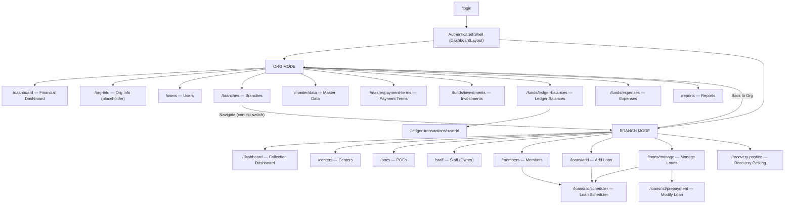
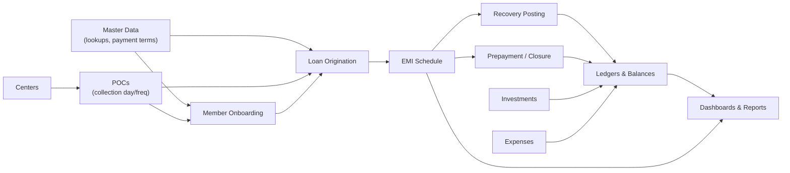
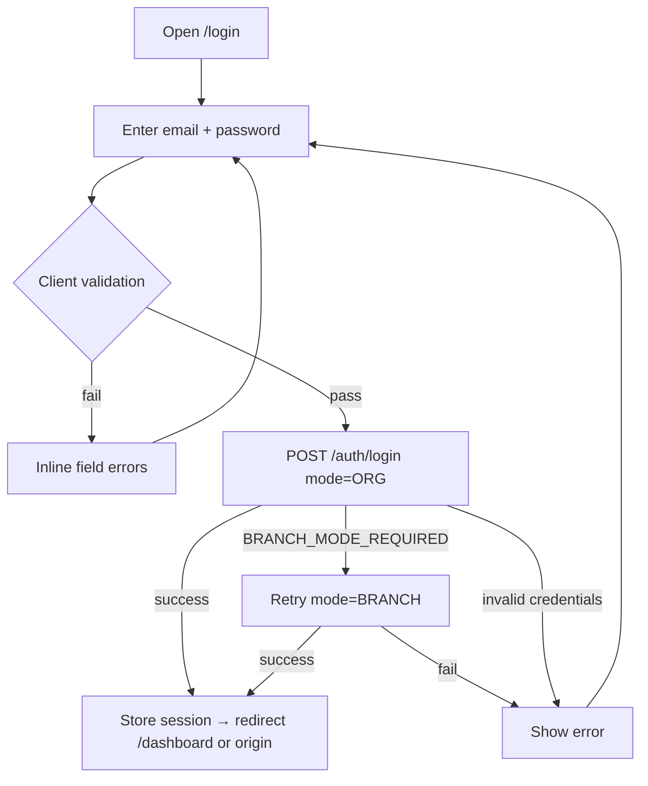
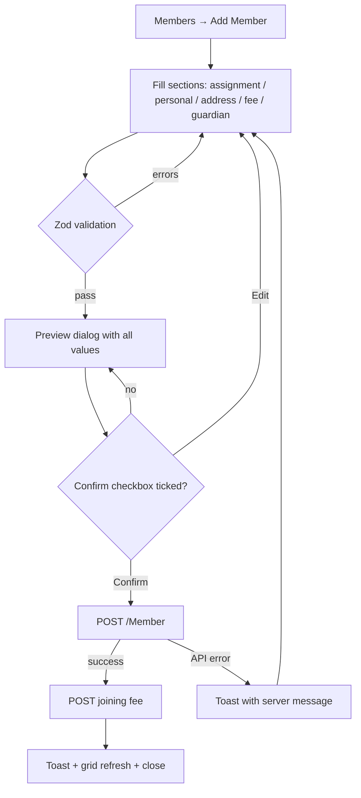
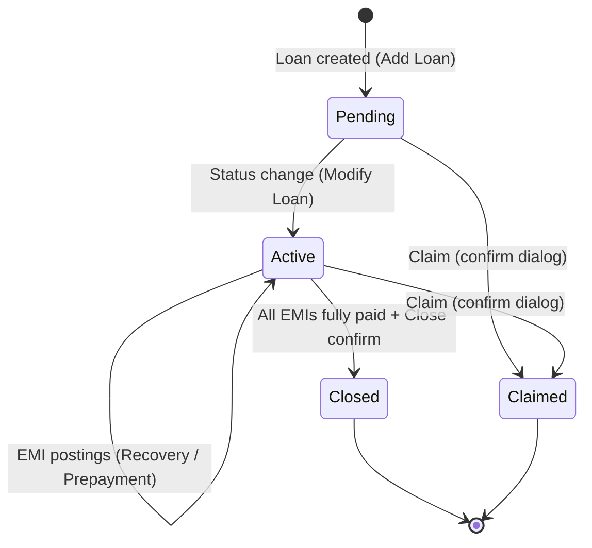

# MicroCredit.Web — UI/UX Application Documentation

**Audience:** Product Managers · Designers · Business Analysts · Stakeholders
**Version:** 1.0 · **Date:** 2026-06-10
**Companion document:** [`docs/MASTER_INDEX.md`](./MASTER_INDEX.md) (full technical inventory with stable IDs — PG/CMP/API/FRM/TBL/WF references used below)

---

## Table of Contents

1. [Executive Summary](#1-executive-summary)
2. [User Personas](#2-user-personas)
3. [Information Architecture](#3-information-architecture)
4. [Application Modules](#4-application-modules)
5. [Screen Inventory](#5-screen-inventory)
6. [Detailed Screen Documentation](#6-detailed-screen-documentation)
7. [User Flows](#7-user-flows)
8. [UX Analysis](#8-ux-analysis)
9. [UI Design System Analysis](#9-ui-design-system-analysis)
10. [Responsive Design Review](#10-responsive-design-review)
11. [Accessibility Review](#11-accessibility-review)
12. [User Journey Maps](#12-user-journey-maps)
13. [Feature Enhancement Recommendations](#13-feature-enhancement-recommendations)
14. [Wireframe Documentation](#14-wireframe-documentation)
15. [Product Improvement Opportunities](#15-product-improvement-opportunities)

---

# 1. Executive Summary

| Item | Detail |
|------|--------|
| **Application Name** | MicroCredit.Web (operating brand: *Navya Micro Credit Services*) |
| **Type** | Web application (responsive SPA) — React 19 + TypeScript |
| **Domain** | Micro-finance / micro-credit lending and field collections |
| **Deployment contexts** | Two operating modes per session: **ORG** (head-office administration) and **BRANCH** (field operations) |

## 1.1 Business Purpose

MicroCredit.Web digitizes the full operating cycle of a micro-credit organization: raising investor capital, disbursing small short-term loans to members (borrowers) organized under centers and POCs (Points of Contact / collection agents), collecting weekly EMIs in the field, and tracking every rupee through internal ledgers, expenses, and financial reports.

## 1.2 Target Users

| User | Context |
|------|---------|
| Organization Owner | Head office; oversees finances, branches, users, master data, reports |
| Branch Staff | Field/branch office; manages members, loans, daily collections |
| Branch Admin | Restricted branch oversight (dashboard visibility only) |
| Investor | Capital provider; account exists in system, dashboard-only access |

## 1.3 Key Business Problems Solved

1. **Manual loan bookkeeping** → Centralized loan origination with auto-calculated interest, fees, EMI schedules, and payment-term templates.
2. **Untracked field collections** → Daily Recovery Posting workflow tied to schedule dates, centers, POCs, and named collectors with sequential-EMI enforcement.
3. **Cash leakage / fund opacity** → Per-user ledgers, fund transfers, investments, and expenses feed a real-time financial dashboard (cash-in-hand, outstanding principal, accrued interest).
4. **Paper member records** → Digital member onboarding with KYC validation (Aadhaar, age, guardian) plus printable bilingual membership forms and promissory notes.
5. **No portfolio visibility** → ORG financial dashboard + BRANCH collection-schedule dashboards (today/tomorrow due lists per POC and per staff member).

## 1.4 Main Features

| Feature | Mode | Summary |
|---------|------|---------|
| Financial Dashboard | ORG | KPIs (remittance, credit, net income, cash in hand), insights grid, collections vs capital chart |
| Collection Dashboard | BRANCH | Today/Tomorrow due schedules by POC; Owner-only staff-schedule rollups |
| User & Staff Management | ORG / BRANCH | Owner/Investor and Staff/BranchAdmin accounts, password resets, deactivation |
| Branch / Center / POC Management | ORG / BRANCH | Operating hierarchy with collection day/frequency per POC |
| Master Data | ORG | Lookup values (states, payment modes, relationships) and payment-term templates |
| Member Onboarding | BRANCH | Two-step (form → preview confirm) member creation with joining fee capture |
| Loan Origination | BRANCH | Member search → term-driven loan calculator → disbursement |
| Loan Servicing | BRANCH | EMI schedule view, prepayment/modification, claim, full closure |
| Recovery Posting | BRANCH | Daily field-collection posting with validation rules |
| Funds Management | ORG | Investments, ledger balances, fund transfers, expenses |
| Reports & Documents | ORG / BRANCH | Excel collection sheet; print-ready membership form & promissory note |

---

# 2. User Personas

## Persona 1 — "Owner Omkar" (Organization Owner)

| Attribute | Detail |
|-----------|--------|
| **User Type** | ROLE-01 Owner — the only role with full system access; works in both ORG and BRANCH modes |
| **Goals** | Grow the loan book profitably; know cash position daily; ensure branches collect on schedule; control who can do what |
| **Pain Points** | Must mentally juggle two contexts (ORG vs BRANCH); no consolidated cross-branch view on one screen; reports limited to a single Excel download; deactivation is one-way (no reactivate in UI) |
| **Responsibilities** | Create branches, users, staff; maintain master data and payment terms; record investments and expenses; transfer funds; review dashboards and reports; intervene on loan statuses (claim/close) |
| **Typical Journey** | Log in (ORG) → Dashboard KPIs → review Ledger Balances/Expenses → Branches → *Navigate* into a branch → Branch dashboard (staff schedules) → spot-check Manage Loans → *Back to Org* → download collection sheet |

## Persona 2 — "Staff Sunita" (Branch Field Staff)

| Attribute | Detail |
|-----------|--------|
| **User Type** | ROLE-02 Staff — BRANCH mode only |
| **Goals** | Finish today's collections quickly; onboard members without paperwork errors; issue loans the same day a member qualifies |
| **Pain Points** | Heavy data entry on mobile in the field; strict sequential-EMI rules require back-tracking when an earlier week is unpaid; overdue rows must be handled in a different screen (Recovery Posting vs Modify Loan); search requires exact-ish name typing (no fuzzy/global search) |
| **Responsibilities** | Maintain centers, POCs, members; originate loans; post daily recoveries; print membership forms / promissory notes for signatures |
| **Typical Journey** | Log in (auto BRANCH) → Dashboard "Today" due list per POC → Recovery Posting → filter date+center+POC → select rows → set Collected By → Post → onboard walk-in member → Add Loan for eligible member |

## Persona 3 — "Admin Arun" (Branch Admin)

| Attribute | Detail |
|-----------|--------|
| **User Type** | ROLE-03 BranchAdmin — BRANCH mode; deliberately excluded from all operational menus |
| **Goals** | Monitor branch performance without touching transactions |
| **Pain Points** | Sees only the dashboard; cannot drill into loans or members even read-only; role exists in staff-creation form but offers little utility — likely an under-specified role |
| **Responsibilities** | Oversight / reporting up to the Owner |
| **Typical Journey** | Log in → Branch dashboard (today/tomorrow schedules) → log out |

## Persona 4 — "Investor Indira" (Capital Provider)

| Attribute | Detail |
|-----------|--------|
| **User Type** | ROLE-04 Investor — ORG mode; dashboard-only menu |
| **Goals** | Track her invested capital and returns |
| **Pain Points** | No self-service statement: her investments and ledger are visible only to the Owner; her account primarily exists so the Owner can attribute investments/transfers to her |
| **Responsibilities** | None inside the system (passive account) |
| **Typical Journey** | Rarely logs in; if she does: Dashboard → log out. Otherwise the Owner records investments on her behalf |

## Persona 5 — "Member Meena" (Borrower — *not a system user*)

Members are **data subjects, not users**: onboarded by staff, they receive printed documents (membership form, promissory note) and repay weekly via POCs. Their experience is mediated entirely through Staff Sunita — relevant for service design, not UI access.

---

# 3. Information Architecture

## 3.1 Site Map



## 3.2 Navigation Structure

| Element | Behavior |
|---------|----------|
| **Sidebar** (left, 256 px desktop / 288 px drawer mobile) | Org identity block (logo tile, org name, branch name when in BRANCH, address) + mode/role-filtered menu with icons; expandable groups (Master, Funds, Loans) with chevron indicators; active item = solid primary pill, active child = tinted pill |
| **Header** (sticky, 56 px) | Hamburger (mobile) · mode badge (blue **Org** / green **Branch**) · user name chip · **Back to Org** (BRANCH + Owner, ≥sm only) · **Log out** |
| **In-page navigation** | Row actions on tables (Navigate, View Schedule, Modify, Open Transactions, View Loan) and "Back to …" buttons; no breadcrumbs |
| **Redirects** | `/` → `/dashboard`; unknown URLs → `/`; legacy `/loans/recovery-posting` → `/recovery-posting` |

## 3.3 Menu Hierarchy

```text
ORG mode                            BRANCH mode
├── Dashboard                       ├── Dashboard
├── Org Info                        ├── Centers            (not BranchAdmin)
├── Users           (Owner)         ├── POCs               (not BranchAdmin)
├── Branches        (Owner)         ├── Staff              (Owner)
├── Master ▸                        ├── Members            (not BranchAdmin)
│   ├── Master Data                 ├── Loans ▸            (not BranchAdmin)
│   └── Payment Terms               │   ├── Add Loan
├── Funds ▸                         │   └── Manage Loan
│   ├── Investments                 └── Recovery Posting   (not BranchAdmin)
│   ├── Ledger Balances
│   └── Expenses
└── Reports         (not BranchAdmin; route Owner-only)
```

## 3.4 Feature Relationships



Key dependency chain: **Payment Terms → Loan calculator**, **POC collection day → loan collection-start validation**, **Schedule rows → both collection screens**, **all money movements → ledger → dashboard**.

## 3.5 User Access Levels

| Capability | Owner | Staff | BranchAdmin | Investor |
|------------|:-----:|:-----:|:-----------:|:--------:|
| ORG dashboard / financials | ✅ | — | — | ✅ (dashboard only) |
| Users, Branches, Master, Funds, Reports | ✅ | — | — | — |
| Switch ORG ↔ BRANCH | ✅ | — | — | — |
| BRANCH dashboard | ✅ | ✅ | ✅ | — |
| Centers, POCs, Members, Loans, Recovery | ✅ | ✅ | — | — |
| Staff management | ✅ | — | — | — |
| Staff-schedules dashboard view | ✅ | — | — | — |

Enforcement is two-layer: menu filtering (`app-menu.ts`) **and** route guards (`ProtectedRoute`) with toast + redirect on violation. Unknown roles degrade to a dashboard-only menu with a warning banner.

---

# 4. Application Modules

## 4.1 Authentication & Session

| Aspect | Detail |
|--------|--------|
| **Purpose** | Secure entry; establish ORG or BRANCH context; keep sessions valid across tabs |
| **Screens** | Login (PG-00) |
| **User Actions** | Sign in; (implicit) auto token refresh; log out; switch context |
| **Inputs** | Email, password |
| **Outputs** | JWT session (localStorage), role/mode-scoped UI |
| **Dependencies** | Auth API (API-01); all other modules depend on it |

## 4.2 Dashboards

| Aspect | Detail |
|--------|--------|
| **Purpose** | At-a-glance financial health (ORG) and collection workload (BRANCH) |
| **Screens** | Dashboard (PG-01) — two mode-specific variants |
| **User Actions** | Toggle chart mode (Collections/Capital); Today/Tomorrow toggle; expand POC → member rows; Owner: My View ↔ Staff Schedules |
| **Inputs** | None (read-only) |
| **Outputs** | KPI cards, insights grid, bar chart, schedule tables |
| **Dependencies** | Report summary API (API-04), report endpoints (API-16); branch context for BRANCH view |

## 4.3 Organization Administration

| Aspect | Detail |
|--------|--------|
| **Purpose** | Manage org-level accounts and operating units |
| **Screens** | Users (PG-02), Branches (PG-04), Org Info placeholder (PG-03) |
| **User Actions** | Create/edit users (Owner/Investor) and branches; reset passwords; deactivate; navigate into branch |
| **Inputs** | FRM-14 user form, FRM-02 branch form, FRM-15 reset password |
| **Outputs** | Updated account/branch lists; new BRANCH session on navigate |
| **Dependencies** | Master Data (state lookup) for branch address |

## 4.4 Master Data

| Aspect | Detail |
|--------|--------|
| **Purpose** | Single source for reference values and loan product templates |
| **Screens** | Master Data (PG-05), Payment Terms (PG-06) |
| **User Actions** | CRUD lookups (key/code/value/sort) and payment terms (terms count, interest %, fees) |
| **Inputs** | FRM-09, FRM-08 |
| **Outputs** | Drives dropdowns app-wide (states, payment modes, relationships, PAYMENT_TERM keys) and the loan calculator |
| **Dependencies** | None (foundation module) |

## 4.5 Funds Management

| Aspect | Detail |
|--------|--------|
| **Purpose** | Track capital in (investments), money between users (transfers), money out (expenses) |
| **Screens** | Investments (PG-07), Ledger Balances (PG-08), User Ledger Transactions (PG-10), Expenses (PG-09) |
| **User Actions** | Add investment; create fund transfer; add expense; drill into a user's transactions |
| **Inputs** | FRM-05, FRM-06, FRM-04 |
| **Outputs** | Ledger balances; transaction history; dashboard cash figures |
| **Dependencies** | Users module (payer/payee selection); collections feed ledgers automatically |

## 4.6 Branch Operations Setup

| Aspect | Detail |
|--------|--------|
| **Purpose** | Maintain the field hierarchy: Centers → POCs → Members |
| **Screens** | Centers (PG-12), POCs (PG-13), Staff (PG-14) |
| **User Actions** | CRUD centers/POCs/staff; set POC collection day & frequency; staff password resets |
| **Inputs** | FRM-03, FRM-12, FRM-13/16 |
| **Outputs** | Assignment options for members/loans; collection-day rule for loan validation |
| **Dependencies** | Master Data (states, PAYMENT_TERM frequency); Users API for "collection by" |

## 4.7 Member Management

| Aspect | Detail |
|--------|--------|
| **Purpose** | Onboard and maintain borrowers with KYC and joining fee |
| **Screens** | Members (PG-15) |
| **User Actions** | Add member (two-step with confirm preview), edit (diff-highlighted preview), deactivate, jump to loans, print PN/MF documents |
| **Inputs** | FRM-10 (assignment, personal, address, guardian, joining fee) + FRM-11 confirm |
| **Outputs** | Member records; joining-fee ledger entry; printable documents |
| **Dependencies** | Centers, POCs, Master Data, Users (collected-by); Loans module consumes members |

## 4.8 Loan Management

| Aspect | Detail |
|--------|--------|
| **Purpose** | Originate, monitor, and service loans through their lifecycle |
| **Screens** | Add Loan (PG-16), Manage Loans (PG-17), Loan Scheduler (PG-18), Modify Loan / Prepayment (PG-19) |
| **User Actions** | Search member; create loan (auto-calculated); view schedule; post EMI prepayments; bulk-apply payment mode; change status (Pending↔Active); claim; fully close |
| **Inputs** | FRM-07 loan form; FRM-26 inline prepayment editor |
| **Outputs** | Loan + EMI schedule records; ledger postings; closed/claimed statuses |
| **Dependencies** | Members, Payment Terms, POC collection day, Master Data (payment modes), Recovery Posting API |

## 4.9 Recovery Posting (Daily Collections)

| Aspect | Detail |
|--------|--------|
| **Purpose** | Post the day's field collections accurately and sequentially |
| **Screens** | Recovery Posting (PG-20) |
| **User Actions** | Filter by date/center/POC; select schedule rows (auto-fill EMI); adjust amounts/splits/status/mode; choose Collected By; post |
| **Inputs** | FRM-27 inline editor |
| **Outputs** | Paid/Partial/Overdue installment statuses; ledger entries |
| **Dependencies** | Loan schedules, POCs/Centers, Users (collected-by), Master Data (payment modes); requires BRANCH context |

## 4.10 Reports & Documents

| Aspect | Detail |
|--------|--------|
| **Purpose** | Export operational data; produce signable member documents |
| **Screens** | Reports (PG-11); document printing from Members grid |
| **User Actions** | Download Member Wise Collection Sheet (.xlsx); print Membership Form (MF) / Promissory Note (PN) |
| **Inputs** | None (one-click) |
| **Outputs** | Excel file; print-ready bilingual HTML popups |
| **Dependencies** | Report API (API-16); browser popups enabled for printing |

---

# 5. Screen Inventory

Legend: screen IDs from the Master Index. "Shell" = standard sidebar + header layout (all screens except Login).

| ID | Screen | Purpose | User Goal | Key Components | Forms | Tables | Primary Buttons | Popups | Navigation Links |
|----|--------|---------|-----------|----------------|-------|--------|-----------------|--------|------------------|
| PG-00 | Login | Authenticate | Get into my workspace | Centered card, brand block | FRM-01 | — | Sign In | — | → /dashboard |
| PG-01 | Dashboard (ORG) | Financial overview | Know cash & income position | KPI cards, insights grid, bar chart, toggle | — | TBL-18 | chart toggle | — | (sidebar only) |
| PG-01 | Dashboard (BRANCH) | Collection overview | Know what's due today/tomorrow | Metric cards, POC table, nested member table; Owner: staff view toggle | — | TBL-19–23 | Today/Tomorrow, My View/Staff Schedules | — | (sidebar only) |
| PG-02 | Users | Org account admin | Manage Owner/Investor accounts | PageHeader, grid | FRM-14/15 | TBL-12 | ADD USER; row: Edit/Reset/Inactive | add/edit, reset pwd, inactive confirm | — |
| PG-03 | Org Info | (placeholder) | — | Placeholder text | — | — | — | — | — |
| PG-04 | Branches | Branch admin | Manage branches; enter one | PageHeader, grid | FRM-02 | TBL-01 | ADD Branch; row: Edit/Inactive/**Navigate** | add/edit, inactive confirm | Navigate → BRANCH mode |
| PG-05 | Master Data | Reference data | Maintain lookup values | PageHeader, grid | FRM-09 | TBL-07 | Add LookUp; row: Edit/Inactive | add/edit, inactive confirm | — |
| PG-06 | Payment Terms | Loan products | Maintain term templates | PageHeader, grid | FRM-08 | TBL-08 | Add Payment Term; row: Edit/Inactive | add/edit, inactive confirm | — |
| PG-07 | Investments | Capital in | Record investor capital | PageHeader, grid | FRM-05 | TBL-04 | ADD Investment | add dialog | — |
| PG-08 | Ledger Balances | Fund positions | See balances; move funds | PageHeader, grid | FRM-06 | TBL-05 | Create Fund Transfer; row: Open Transactions | transfer dialog | → /ledger-transactions/:userId |
| PG-09 | Expenses | Money out | Record expenses | PageHeader, grid | FRM-04 | TBL-03 | ADD Expense | add dialog | — |
| PG-10 | User Ledger Transactions | Drill-down | Audit one user's ledger | PageHeader, grid | — | TBL-06 | Back to Ledgers | — | ← /funds/ledger-balances |
| PG-11 | Reports | Exports | Download collection sheet | Report card | — | — | Download Report | — | — |
| PG-12 | Centers | Field hierarchy | Manage centers | PageHeader, grid | FRM-03 | TBL-02 | ADD Center; row: Edit/Inactive | add/edit, inactive confirm | — |
| PG-13 | POCs | Collection agents | Manage POCs & collection rules | PageHeader, grid | FRM-12 | TBL-10 | Add POC; row: Edit/Inactive | add/edit, inactive confirm | — |
| PG-14 | Staff | Branch accounts | Manage staff users | PageHeader, grid | FRM-13/16 | TBL-11 | ADD STAFF; row: Edit/Reset/Inactive | add/edit, reset pwd, inactive confirm | — |
| PG-15 | Members | Borrower registry | Onboard & maintain members | PageHeader, MemberGrid | FRM-10/11 | TBL-09 | Add Member; row: Edit/Inactive/Add-View Loan/PN/MF | member wizard (2 dialogs), inactive confirm, print popups | → loan dialog / scheduler |
| PG-16 | Add Loan | Origination | Find member, issue loan | Name-search toolbar, grid | FRM-25 + FRM-07 | TBL-13 | row: Add Loan / View Loan | loan dialog (with EMI preview) | → /loans/:id/scheduler |
| PG-17 | Manage Loans | Portfolio | Monitor active loans | PageHeader, grid | — | TBL-14 | row: View Schedule / Modify | — | → scheduler / prepayment |
| PG-18 | Loan Scheduler | Schedule view | Inspect EMI history | Summary cards, grid | — | TBL-15 | Cancel | — | ← /loans/manage |
| PG-19 | Modify Loan | Servicing | Post EMIs, change status, close/claim | Summary bar, status select, selectable grid | FRM-26 | TBL-16 | Apply to Selected, Claim, Cancel, Save | bulk apply, claim confirm, close confirm, close success | ← /loans/manage |
| PG-20 | Recovery Posting | Daily collections | Post today's collections | Filter bar (date/center/POC/collector), selectable grid, total chip | FRM-27 | TBL-17 | Post recovery | — | — |

---

# 6. Detailed Screen Documentation

## 6.0 Common Shell (all authenticated screens)

| Region | Content |
|--------|---------|
| **Layout structure** | `flex h-screen`: fixed left sidebar + right column (sticky header / scrollable main, padding 12 px mobile / 24 px desktop) on a `bg-muted/40` canvas |
| **Header** | Hamburger (mobile) · mode badge (ORG = blue pill, BRANCH = emerald pill) · user-name chip (≥sm) · *Back to Org* (BRANCH Owner, ≥sm) · *Log out* (icon-only on mobile, icon+label ≥sm) |
| **Sidebar** | Brand tile (Building icon on primary), org name, branch name (BRANCH), address with map-pin; nav list with lucide icons; groups expand/collapse; mobile: 288 px drawer + black/50 backdrop + X close |
| **Global messages** | react-hot-toast top toasts for success/error; amber banner inside main when role unrecognized; session-expiry toast "Your session has expired. Please sign in again." on forced logout |
| **Error fallback** | API errors mapped by `apiErrorHandler`: server message → title → error → first validation message → "Something went wrong. Please try again." / "Network error. Please check your connection and try again." |

Standard CRUD screens (PG-02, 04–09, 12–14) share a pattern: **PageHeader** (title `text-2xl font-semibold`, description, primary Add button) → **MRT table card** (column filters, sorting, client pagination, responsive column hiding with expand-row detail panel) → **native `<dialog>` modals** (header / scrollable body / footer with Cancel + primary action, full-width buttons stacked reverse on mobile). Their specifics below focus on what differs.

## 6.1 PG-00 Login

| Aspect | Detail |
|--------|--------|
| Layout | Full-viewport centered card; no shell |
| Main content | Brand heading, email + password fields, Sign In button |
| Action buttons | **Sign In** (primary, disabled while submitting) |
| Validation | Email: required, valid format. Password: min 6 chars. Inline field errors under inputs |
| Error messages | Invalid credentials → server message via toast/inline; `BRANCH_MODE_REQUIRED` handled invisibly (auto-retry as BRANCH); network → "Network error…" |
| Success | Silent redirect to original destination or `/dashboard` |

## 6.2 PG-01 Dashboard — ORG variant

| Aspect | Detail |
|--------|--------|
| Main content | (1) KPI metric cards — Remittance, Credit, Insurance, Claimed, Net Income, Cash In Hand; (2) **Financial Insights** card grid (9 INR metrics: received principal/interest, joining/processing fees, insurance, claimed, expenses, outstanding principal, interest accrued); (3) horizontal bar chart with **Collections / Capital** segmented toggle; live date-time highlight |
| Action buttons | Segmented toggle only |
| Validation / errors | Read-only; query error → inline error state with retry |
| Success messages | n/a |

## 6.3 PG-01 Dashboard — BRANCH variant

| Aspect | Detail |
|--------|--------|
| Main content | Metric cards (total POCs, members due, collected amount) → **POC Schedules** table with **Today/Tomorrow** toggle and global search; row expand → member EMI detail table (due badges, status colors). **Owner only:** segmented **My View / Staff Schedules** toggle; staff view nests Staff → POC → member-line tables |
| Empty/edge states | No branch context (Owner who hasn't navigated) → guidance card linking to Branches |
| Validation / errors | Read-only; retry buttons on failed report queries |

## 6.4 PG-02 Users · 6.5 PG-14 Staff

| Aspect | Users | Staff |
|--------|-------|-------|
| Table columns | Id, Full Name, Email, Role, Address, Actions | same |
| Roles offered | Owner, Investor | Staff, BranchAdmin |
| Dialogs | Add/Edit (FRM-14), Reset Password (FRM-15), Inactive confirm | FRM-13, FRM-16, confirm |
| Validation | Names letters-only ≤225; email format; phone `^[6-9]\d{9}$` (optional for users); password (create/reset): ≥8 incl. upper+lower+digit+special; confirm must match; hidden `level` field auto-sent | Names alphanumeric ≤250; city alphabetic; PIN 6 digits; same password policy |
| Error messages | Duplicate email → inline error on email field; API errors → toast | same |
| Success | Toast + table refetch + dialog close | same |

## 6.6 PG-04 Branches

| Aspect | Detail |
|--------|--------|
| Table | Id, Name, Address (composed), Phone, Actions |
| Row actions | Edit · Set Inactive · **Navigate** (switches session into branch and routes home) |
| Dialog validation (FRM-02) | Name alphanumeric ≤200; address1 required ≤500; city/state/country required; zip exactly 6 digits; phone `^[6-9]\d{9}$`; digit-only sanitizers on phone/zip |
| Success | "Successfully switched to Org mode"-style toasts on context moves; create/update toast + refetch |

## 6.7 PG-05 Master Data · 6.8 PG-06 Payment Terms

| Aspect | Master Data | Payment Terms |
|--------|-------------|---------------|
| Table | Id, Key, Value, Code, Numeric Value, Sort Order, Status (static "Active"), Actions | Id, Payment Term, Payment Type, No Of Terms, Processing Fee, Rate Of Interest, Insurance Fee, Actions |
| Dialog validation | Key/code/value required; sortOrder int ≥0; numericValue optional | All required; noOfTerms ≥1; fees/rate ≥0 |
| Notes | Lookup key chosen from existing keys (`/masterLookups/keys`) | paymentTerm select sourced from "PAYMENT_TERM" lookups |

## 6.9 PG-07 Investments · 6.10 PG-09 Expenses · 6.11 PG-08 Ledger Balances · 6.12 PG-10 User Ledger Transactions

| Aspect | Detail |
|--------|--------|
| Investments | Columns: Investor, Amount, Investment Date, Created By, Created Date. Dialog FRM-05: investor required, amount > 0, both dates required |
| Expenses | Columns: User, Amount, Payment Date, Created By, Created Date, Description. Dialog FRM-04 adds comments ≥2 chars ("why the expense was made") |
| Ledger Balances | Columns: User Name, Amount, Actions. **Create Fund Transfer** dialog FRM-06: from ≠ to (cross-field refine), amount > 0, comments ≥2; ⚠ date field mislabeled "Investment Date". Row action → transactions drill-down |
| Ledger Transactions | Read-only history: From/To User, Amount, Payment Date, Created Date, Type, Comments; sorted newest-first; page size 20; **Back to Ledgers** |

## 6.13 PG-11 Reports

Single card "Member Wise Collection Sheet" + **Download Report** button → fetches blob, triggers browser `.xlsx` download. Errors toast; success is the download itself (no toast).

## 6.14 PG-12 Centers · 6.15 PG-13 POCs

| Aspect | Centers | POCs |
|--------|---------|------|
| Table | Id, Name, Address, City, Actions | Id, Name, Phone, Center Name, Address, Actions |
| Dialog validation | Name ≤100, address ≤250, city ≤50, all required | Names/phone/center/collection day/frequency/collected-by required; phone pattern; address optional |
| Business significance | — | **Collection Day** here gates loan collection-start dates (FRM-07) |
| Empty states | API-provided `emptyMessage` rendered when list empty | same |

## 6.16 PG-15 Members

| Aspect | Detail |
|--------|--------|
| Layout | PageHeader (Add Member) → MemberGrid |
| Table | ID, Member Code, Full Name (member + guardian), Phone, DOB/Age, Center, Address, POC, Actions — heavy responsive hiding, custom expand panel with pre-wrapped address |
| Row actions | Edit · Inactive · **Add Loan** / **View Loan** (depends on open-loan flag) · **PN** (promissory note print) · **MF** (membership form print); labels collapse to icons on mobile |
| Member dialog (FRM-10) | Sections: Assignment (Center → POC cascading autocompletes), Personal, Address, Joining Fee (add-mode only), Guardian. Computed read-only Age fields |
| Validation | Phones `^[6-9]\d{9}$`; Aadhaar 12 digits; PIN 6 digits; member & guardian age ≥18; relationship "Other" → free-text required; add-mode: payment mode + joining fee > 0 + paid date (not future) + collected-by required |
| Confirmation step (FRM-11) | Read-only preview; edit-mode highlights changed fields; checkbox "I confirm…" gates the Confirm button; **Edit** returns to form |
| Errors / success | No-change edit blocked with message; API errors toast; success toast + grid refetch; print actions require popups enabled |

## 6.17 PG-16 Add Loan

| Aspect | Detail |
|--------|--------|
| Toolbar | First / Middle / Last name inputs — live member search ("Recent Memebers" header label when unfiltered — note typo) |
| Table | Name, Address, Phone, Guardian, Center, POC, Actions |
| Row logic | `primaryOpenLoanId > 0` → **View Loan** (to scheduler); else **Add Loan** (opens FRM-07) |
| Loan dialog (FRM-07) | Inputs: loan amount, payment term, disbursement date, collection start date, saving amount. Auto-computed read-only: interest, processing fee, insurance fee, total, terms count, collection term + **EMI preview table** |
| Validation | Amount > 0; term required; collection start ≥ disbursement (superRefine); collection-start weekday must equal POC's collection day (custom blocking error) |
| Success | Toast + member search invalidated (open-loan flag refreshes) |

## 6.18 PG-17 Manage Loans · 6.19 PG-18 Loan Scheduler

| Aspect | Manage Loans | Loan Scheduler |
|--------|--------------|----------------|
| Content | Active-loan grid: name, POC, status, totals, Paid/NoOfTerms, remaining balance (IDs & technical columns hidden by default on desktop) | Summary cards (member, total, remaining, paid) + read-only EMI grid with color-coded status badges (Paid / Partial Paid / Overdue / Claimed / Not Paid) |
| Actions | View Schedule → PG-18 · Modify → PG-19 | Cancel → back to Manage Loans |
| Errors | Inline error + empty states | same |

## 6.20 PG-19 Modify Loan (Prepayment)

| Aspect | Detail |
|--------|--------|
| Layout | Summary bar (member, loan status select) → selectable EMI grid (page size 20) → footer actions |
| Status control | Pending ↔ Active editable; Claimed/Closed render read-only |
| Row editing | Selecting a row unlocks Paid Amount (auto principal/interest split), Payment Mode, Reasons; Overdue rows locked (must use Recovery Posting) |
| Action buttons | **Apply to Selected** (bulk mode/reason popup) · **Claim** (confirm dialog) · **Cancel** · **Save** |
| Validation (imperative) | Rows XOR status change per save; sequential EMIs (no skipping earlier unpaid); amount > 0 and ≤ EMI; mode required; partial-before-full ordering; full closure requires *all* closable rows fully paid |
| Popups | Bulk apply · Claim confirm · Close confirm · Close success summary |
| Errors / success | Rule violations → specific toast explanations; success → toast, refetch, status badge updates |

## 6.21 PG-20 Recovery Posting

| Aspect | Detail |
|--------|--------|
| Filter bar | Schedule date (default today) · Center autocomplete · POC autocomplete (center-dependent) · **Collected By** select · selected-total chip |
| Table | Member, Loan Id, Installment, Actual EMI/Principal/Interest, editable Payment/Principal/Interest, Payment Mode, Status, Comments, POC. Row select auto-fills full EMI (or Overdue for past dates). Scroll container capped at `min(65vh, 680px)`; page size 20 |
| Action button | **Post recovery** |
| Validation | Collected By required; per row: mode required (except Overdue), status ≠ Not Paid, payment = principal + interest, payment ≤ EMI; cross-loan sequential-EMI check (fetches full schedule per loan) |
| Errors / success | Violation → explanatory toast naming the row/rule; success → "posted" toast + refetch |
| Edge | No branch context → instruction card to navigate via Branches |

## 6.22 PG-03 Org Info

Placeholder screen ("coming soon" style); navigation exists but feature is unbuilt — flagged in §15 recommendations.

---

# 7. User Flows

## 7.1 Login



Step-by-step: (1) user opens app, unauthenticated routes bounce to `/login` preserving the intended URL; (2) submits credentials; (3) system tries ORG mode first, silently falling back to BRANCH for branch-only accounts; (4) session stored, query cache cleared, redirect to original destination; (5) other open tabs sync via broadcast.

## 7.2 Registration

**There is no self-registration.** All accounts are provisioned by an Owner:

| Step | Actor | Action |
|------|-------|--------|
| 1 | Owner | Users (ORG) or Staff (BRANCH) → **ADD** |
| 2 | Owner | Fills name, email, phone, role; sets initial strong password (+ confirm) |
| 3 | System | Duplicate email → inline field error; else create + toast |
| 4 | Owner | Communicates credentials out-of-band (no invite email exists) |
| 5 | New user | Logs in; no forced password change (gap — see §13) |

## 7.3 Search

| Context | Mechanism |
|---------|-----------|
| Add Loan (PG-16) | Dedicated first/middle/last name fields → server-side member search per keystroke/change |
| All CRUD grids | MRT **per-column filters** + sorting (client-side) |
| Dashboard schedule tables | MRT **global search** box ("Search by name or ID…") |
| Recovery Posting | Structured filters (date, center, POC) instead of text search |

Flow (Add Loan): enter name fragment → table refreshes → row shows either **Add Loan** or **View Loan** → act. *No app-wide global search exists.*

## 7.4 Create Record (canonical: Member)



Simple creates (branch, center, expense, investment, lookup, payment term, POC, staff, user) follow the same pattern minus the preview step: dialog → validate → POST → toast → refetch.

## 7.5 Edit Record

1. Row **Edit** action → dialog pre-filled with current values (edit mode).
2. User changes fields; same validation as create (password section hidden for users/staff).
3. Member edit only: preview dialog highlights changed fields; **save blocked if nothing changed**.
4. PUT request → success toast → refetch; duplicate email/API errors map back to fields where possible.

## 7.6 Delete Record (Soft Delete)

Deletion is universally a **"Set Inactive"** soft delete:

1. Row **Inactive/Delete** action → confirmation dialog naming the entity.
2. Confirm → `DELETE …/{id}/inactive` (payment terms use a hard `DELETE`).
3. Toast + list refetch (record disappears from active lists).
4. ⚠ **No reactivation UI exists** — recovery requires backend intervention (see §15).

## 7.7 Approval Process (Loan Lifecycle)

There is no multi-actor approval queue; the lifecycle is status-driven and operator-controlled:



Guards: claim blocked once Closed; closure requires every closable installment selected and fully paid; Claimed/Closed loans become read-only. Installment-level statuses (Not Paid → Paid / Partial Paid / Overdue / Claimed) advance independently through the collection screens.

## 7.8 Reporting

| Step | ORG financial | BRANCH operational | Excel export |
|------|---------------|--------------------|--------------|
| 1 | Open Dashboard | Open Dashboard (branch context) | Reports page |
| 2 | Review KPIs + insights grid | Toggle Today/Tomorrow | Click **Download Report** |
| 3 | Toggle Collections/Capital chart | Expand POC → member detail | Blob downloads as `.xlsx` |
| 4 | — | Owner: switch to Staff Schedules view, drill Staff → POC → members | Open in Excel |

---

# 8. UX Analysis

## 8.1 UX Strengths

| # | Strength | Evidence |
|---|----------|----------|
| 1 | **Consistent CRUD pattern** | Every list page shares PageHeader → table → dialog structure; users learn once, apply everywhere |
| 2 | **Two-step member confirmation** | Preview + explicit confirm checkbox prevents costly KYC data errors; edit mode highlights diffs |
| 3 | **Domain-aware validation** | Indian mobile (`6–9` prefix), Aadhaar 12-digit, PIN 6-digit, age ≥18, POC collection-day vs loan start-date matching — errors caught before they hit the field |
| 4 | **Auto-calculation in loan form** | Picking a payment term instantly derives interest, fees, totals, terms, and an EMI preview — removes arithmetic risk |
| 5 | **Sequential-EMI enforcement** | Collections cannot skip weeks; protects ledger integrity in both collection screens |
| 6 | **Mode/role-scoped UI** | Menus and routes both filter by mode+role, so users never see actions they can't perform; unknown roles degrade gracefully with a banner |
| 7 | **Responsive tables with detail panels** | 23 per-table column-visibility maps; hidden data stays reachable via expand rows instead of disappearing |
| 8 | **Resilient sessions** | Silent token refresh, multi-tab logout sync, clear "session expired" messaging |
| 9 | **Smart row auto-fill in Recovery Posting** | Selecting a row pre-fills the full EMI (or Overdue for past dates), making the happy path one click |

## 8.2 UX Weaknesses

| # | Weakness | Impact |
|---|----------|--------|
| 1 | **Split collection mental model** — Overdue EMIs are locked on Modify Loan and must be handled in Recovery Posting, with no link between the screens | Staff confusion, extra navigation |
| 2 | **No breadcrumbs / location feedback** beyond sidebar highlight; deep pages (scheduler, prepayment, ledger drill-down) rely on "Cancel/Back" buttons | Disorientation on deep links |
| 3 | **No reactivation path** for soft-deleted records | Fear of using "Inactive"; support tickets |
| 4 | **Copy defects**: "Recent Memebers" typo (Add Loan), Fund Transfer date labeled "Investment Date", Master Lookup status hardcoded "Active" | Erodes trust, confuses transfer entry |
| 5 | **Org Info is a dead menu item** (placeholder) | Broken expectation |
| 6 | **No global search**; per-column filters only | Slow record lookup for non-technical users |
| 7 | **Client-side pagination everywhere** | Will degrade with portfolio growth (every loan/member fetched at once) |
| 8 | **Single export report**; dashboards are not exportable | Owners fall back to manual compilation |
| 9 | **Print via popup `window.open`** | Blocked popups silently break PN/MF printing |
| 10 | **BranchAdmin role ambiguity** — creatable in staff form yet excluded from nearly everything; Staff menu config contradicts itself (`roles` includes, `excludeRoles` removes) | Misconfigured expectations |

## 8.3 Accessibility Issues (summary — detail in §11)

- Sparse ARIA: ~70 attributes across the app, mostly `aria-label` on icon buttons and `aria-hidden` on icons; no landmarks/labels audit evident on tables and dialogs.
- Mixed component kits (native dialog + MUI Autocomplete + custom selects) → inconsistent keyboard/focus behavior.
- Color-coded status badges (Paid/Partial/Overdue) need text contrast verification; some rely on color alone in dense tables.

## 8.4 Usability Issues

| Issue | Location |
|-------|----------|
| Loan dialog requires knowing the POC's collection day in advance — error appears only after picking a date | FRM-07 |
| "Save" on Modify Loan handles three different intents (post EMIs / change status / close), guarded by toast-error rules users must learn by trial | PG-19 |
| Reset Password offers no generated/strength-meter assistance despite a strict policy | FRM-15/16 |
| Hidden `level` field in user form is sent silently — invisible business meaning | FRM-14 |
| Joining fee only collectable at member creation; no later fee capture UI | FRM-10 |
| Date inputs default formats vary; no date-picker constraints communicated (e.g., disabling non-collection weekdays) | several forms |

## 8.5 Mobile Responsiveness Concerns

- Recovery Posting and Modify Loan involve **per-row numeric entry inside tables** — cramped on phones even with the detail-panel fallback; staff in the field are the primary mobile users.
- MUI Autocomplete dropdowns + native `<dialog>` stacking on small screens can clip on short viewports (90 vh cap helps but long member forms scroll heavily).
- Icon-only action buttons on mobile (PN/MF/Edit) lack visible labels — tooltips don't exist on touch.
- Print flows (popup → print) are unreliable on mobile browsers.

## 8.6 User Friction Points

1. **Owner branch hop:** ORG → Branches → Navigate → work → Back to Org; multi-branch owners repeat this constantly (no branch switcher in header).
2. **Member → loan continuity:** after onboarding, staff must re-find the member under Add Loan (search by name) instead of a direct "create loan now" handoff (the grid's Add Loan action mitigates but only from Members list).
3. **Posting rejection loops:** sequential-EMI violations surface one toast at a time at submit, not inline while selecting rows.
4. **No undo anywhere:** postings, closures, claims, deactivations are all final in the UI.

---

# 9. UI Design System Analysis

The app uses the **shadcn/ui "slate" token system** (CSS custom properties + Tailwind) with MUI providing complex widgets (tables, autocompletes). A dark theme palette is defined but **never activated** (light is forced at `:root`).

## 9.1 Color Palette

| Token | HSL | ≈ Hex | Usage |
|-------|-----|-------|-------|
| `--primary` | 222.2 47.4% 11.2% | `#16233F` (deep navy/slate-900) | Primary buttons, active nav pill, brand tile |
| `--primary-foreground` | 210 40% 98% | `#F8FAFC` | Text on primary |
| `--background` | 0 0% 100% | `#FFFFFF` | Page background |
| `--foreground` | 222.2 84% 4.9% | `#020817` | Body text |
| `--secondary` / `--muted` / `--accent` | 210 40% 96.1% | `#F1F5F9` | Subtle fills, hovers, canvas (`bg-muted/40`) |
| `--muted-foreground` | 215.4 16.3% 46.9% | `#64748B` | Secondary text, inactive nav |
| `--destructive` | 0 84.2% 60.2% | `#EF4444` | Delete/inactive actions |
| `--border` / `--input` | 214.3 31.8% 91.4% | `#E2E8F0` | Borders, input outlines |
| `--ring` | 222.2 84% 4.9% | `#020817` | Focus rings |
| Mode badges | Tailwind `blue-100/800`, `emerald-100/800` | — | ORG (blue) vs BRANCH (green) identity |
| Chart tokens | `--chart-1…5` (orange/teal/navy/yellow/coral) | — | Dashboard bars |
| Legacy CSS | text `#213547`, links `#646cff/#535bf2` | — | Vite-default remnants in `index.css` (inconsistent with token system) |

## 9.2 Typography

| Element | Spec |
|---------|------|
| Family | `system-ui, Avenir, Helvetica, Arial, sans-serif` (no webfont) |
| Base | 16 px, line-height 1.5, weight 400, antialiased |
| Page titles | `text-2xl font-semibold tracking-tight` |
| Section/dialog titles | `text-lg/text-sm font-semibold` |
| Body/table | `text-sm`; metadata `text-xs` |
| Numerals | Default (no tabular-nums despite finance-heavy tables — improvement candidate) |
| Multilingual | Telugu + English in print templates only |

## 9.3 Button Variants (CVA — `components/ui/button.tsx`)

| Variant | Style | Typical use |
|---------|-------|-------------|
| `default` | Solid primary, white text | Add/Save/Post/Sign In |
| `destructive` | Solid red | Set Inactive confirm |
| `outline` | Border + background, accent hover | Cancel, header utilities, secondary actions |
| `secondary` | Light slate fill | Tertiary actions |
| `ghost` | Transparent, accent hover | Inline/table affordances |
| `link` | Underline-on-hover primary text | Navigational text actions |

Sizes: `default` 36 px · `sm` 32 px · `lg` 40 px · `icon` 36×36. Shared traits: `rounded-md`, `text-sm font-medium`, `gap-2`, `focus-visible:ring-1`, `disabled:opacity-50`, auto-sized 16 px SVGs.

## 9.4 Form Controls

| Control | Implementation |
|---------|----------------|
| Text/number/date | Native inputs styled with Tailwind, bordered (`--input`), forced dark-text/white-bg via global CSS |
| Selects | Mostly native `<select>`; lookup-driven options |
| Autocomplete | MUI `Autocomplete` for Centers/POCs (member form, recovery filters) — visually distinct from native controls (inconsistency) |
| Textareas | Comments/description fields |
| Checkbox | Confirmation gate (member preview) |
| Errors | Red helper text below field via RHF + Zod resolvers |
| Read-only computed | Greyed inputs (age, interest, totals) |

## 9.5 Icons

- **lucide-react** (~25 used): navigation (LayoutDashboard, Users, GitBranch, Wallet, Banknote…), chrome (Menu, X, ChevronDown/Right, LogOut, User, Building2, MapPin), actions (Plus, List, RefreshCw).
- **@mui/icons-material** within MRT internals (sort/filter/expand glyphs).
- Convention: 16 px in buttons/nav (`h-4 w-4`), 20 px chrome, `aria-hidden` applied in layout icons.

## 9.6 Cards

`rounded-lg border bg-card shadow-sm` family: KPI metric cards, Financial Insights grid cells, summary cards (scheduler), report download card, guidance/empty-state cards, amber warning banner variant.

## 9.7 Tables

Material React Table v3 throughout: column filters, sorting, client pagination, grouping/pinning enabled on several lists, sticky headers in dashboard panels, row selection (collections screens), expand-row **HiddenColumnsDetailPanel** as the responsive escape hatch, horizontal scroll wrappers. Status cells use tinted badge spans (green/amber/red/slate).

## 9.8 Modals

Native `<dialog>` + `showModal()` with shared shell classes: `rounded-lg border bg-card shadow-lg backdrop:bg-black/50`, width `calc(100vw-1rem)` mobile → `max-w-md/lg/xl/2xl` tiers, `max-h-[90vh]` with scrollable body, structured header/body/footer (`p-4 sm:p-6`), footer buttons stack reverse-column on mobile. Confirmation dialogs are slim variants; member flow stacks a second dialog at `z-[100]`.

## 9.9 Design Patterns

| Pattern | Description |
|---------|-------------|
| List + dialog CRUD | PageHeader action → modal form → toast → refetch |
| Two-step confirm | Form → preview → checkbox-gated confirm (members) |
| Soft delete | "Set Inactive" confirm dialogs everywhere |
| Mode badging | Persistent ORG/BRANCH pill anchors context |
| Segmented toggles | Today/Tomorrow, Collections/Capital, My View/Staff Schedules |
| Progressive disclosure | Expandable nav groups; row expand panels; nested dashboard tables (3 levels) |
| Inline table editing | Select-to-edit rows (prepayment, recovery) |
| Toast feedback | react-hot-toast for all mutations and guard violations |

---

# 10. Responsive Design Review

**Breakpoints** (`lib/responsive/breakpoints.ts` — aligned to Tailwind `md`/`lg`):

| Tier | Range |
|------|-------|
| Mobile | < 768 px |
| Tablet | 768–1023 px |
| Desktop | ≥ 1024 px |

## 10.1 Mobile (< 768 px)

| Aspect | Behavior |
|--------|----------|
| Layout | Single column; main padding 12 px; min supported width 320 px |
| Navigation | Sidebar becomes 288 px slide-in drawer (translate animation) + black/50 backdrop; hamburger in header; X close in drawer; nav tap auto-closes |
| Header | User-name chip and "Back to Org" hidden; logout collapses to icon button |
| Tables | Aggressive column hiding per `tableVisibility` maps (e.g., Members hides 7 columns); expand-row panel exposes hidden fields; horizontal scroll as fallback |
| Dialogs | Width `100vw − 1rem`; 90 vh cap with scrolling body; footer buttons full-width, primary on top (column-reverse) |
| Component tweaks | Button labels shorten ("Fund Transfer", "Schedule"); row-action labels collapse to icons; PageHeader stacks title → actions → toolbar |

## 10.2 Tablet (768–1023 px)

| Aspect | Behavior |
|--------|----------|
| Navigation | Still drawer mode (sidebar fixes only at `lg`) — a notable choice: tablets get the mobile nav |
| Tables | Moderate hiding (IDs, long addresses, created-dates); expand panels active when any column hidden |
| Dialogs/forms | `sm:` styles apply: two-column field grids, inline footers, 24 px padding |
| Header | Full header restored (name chip, labeled logout, Back to Org) |

## 10.3 Desktop (≥ 1024 px)

| Aspect | Behavior |
|--------|----------|
| Layout | Static 256 px sidebar + fluid content; 24 px padding |
| Tables | Most columns visible; Manage Loans & Scheduler still hide technical IDs by default; grouping/pinning available |
| Dashboards | Insights grid reaches 4 columns (`xl:grid-cols-4`); nested drill-down tables comfortable |
| Dialogs | Tier caps (28–42 rem); centered with dimmed backdrop |

## 10.4 Component Adaptation Matrix

| Component | Mobile | Tablet | Desktop |
|-----------|--------|--------|---------|
| Sidebar | Drawer + backdrop | Drawer + backdrop | Fixed column |
| Data tables | Few columns + expand panels | Partial columns + panels | Full columns |
| Dialog footer | Stacked full-width (primary first) | Right-aligned row | Right-aligned row |
| Row actions | Icon-only | Icon + label | Icon + label |
| Insights grid | 1 col | 2 cols | 4 cols |
| Editable-table forms | Detail-panel editing | Inline | Inline |

---

# 11. Accessibility Review

## 11.1 WCAG Compliance Snapshot

No audit tooling or a11y test suite is present. Estimated posture: **partial WCAG 2.1 A; AA not yet met.** Key gaps: form-label programmatic association, status-by-color, focus management in custom popups, missing landmarks/skip links.

## 11.2 Keyboard Navigation

| Area | State |
|------|-------|
| Buttons/links | ✅ Native elements; focus-visible ring (1 px, `--ring`) from the Button primitive |
| Dialogs | ✅ Native `<dialog>.showModal()` gives focus trapping + **Esc to close** for free |
| Sidebar groups | ✅ Real `<button>` toggles |
| MRT tables | ⚠ Relies on MUI defaults; row-selection checkboxes keyboard-usable, but select-to-edit inline flows untested for keyboard-only operation |
| Custom popups in Modify Loan (bulk apply etc.) | ⚠ Verify they use `<dialog>`; if positioned divs, focus can escape |
| Skip link | ❌ None — every page requires tabbing through sidebar first |

## 11.3 Screen Reader Support

- ~70 ARIA attributes total; good: `aria-label` on all icon-only buttons (menu, close, logout), `aria-hidden` on decorative icons.
- ❌ Dialogs lack `aria-labelledby`/`aria-describedby` wiring; titles are visual only.
- ❌ Toast announcements (react-hot-toast) are not guaranteed `aria-live` polite regions for SRs.
- ⚠ Many form fields appear to rely on placeholder/visual labels; only a handful of `htmlFor` bindings were found — labels need a systematic pass.
- ❌ Print templates mix Telugu/English without `lang` attributes.

## 11.4 Color Contrast

| Pair | Verdict |
|------|---------|
| Primary navy on white / white on navy | ✅ ~15:1 |
| Body `#020817` on white | ✅ |
| `muted-foreground #64748B` on white | ✅ AA for normal text (~4.7:1), borderline on muted fills |
| Mode badges (blue-800 on blue-100, emerald-800 on emerald-100) | ✅ |
| Status badges (amber/green tints) & disabled 50%-opacity text | ⚠ Verify — likely sub-AA in places |
| Links `#646cff` on white | ⚠ ~3.9:1 — fails AA for normal text |

## 11.5 Focus States

Buttons: consistent `focus-visible` ring. Native inputs/selects: browser default outlines (inconsistent across browsers, sometimes suppressed by Tailwind resets — verify). MUI Autocomplete: its own focus styling, visually different from the rest. **Recommendation:** unify a 2 px visible ring token across all interactive elements.

## 11.6 ARIA Usage Summary

| Pattern | Count/Status |
|---------|--------------|
| `aria-label` on icon buttons | Present app-wide (good) |
| `aria-hidden` on decorative icons/backdrop | Present (good) |
| Dialog labelling (`aria-labelledby`) | Missing |
| Live regions for async status | Missing |
| Table semantics | Delegated to MRT/MUI (reasonable baseline) |
| Landmarks (`<nav>`, `<header>`, `<main>`) | ✅ Semantic elements used in layout |

---

# 12. User Journey Maps

## 12.1 Owner — Monthly Financial Control (ORG)

| Stage | Action | Touchpoints | Emotion | Pain | Opportunity |
|-------|--------|-------------|---------|------|-------------|
| Review | Check KPIs, cash in hand | Dashboard | 😀 Confident | Snapshot only — no trends | Trend lines, period filters |
| Capital | Record new investment | Investments dialog | 🙂 | Investor must pre-exist as user | Inline "create investor" |
| Allocate | Transfer funds to branch users | Fund Transfer dialog | 😐 | "Investment Date" mislabel; no balance preview | Show balances in dialog |
| Spend | Log expenses | Expense dialog | 🙂 | Free-text categorization only | Expense categories (lookups exist!) |
| Audit | Drill into user ledgers | Ledger Balances → Transactions | 🙂 | No export of ledger | CSV export |
| Report | Download collection sheet | Reports | 😐 | Single report | Report catalog |

## 12.2 Staff — Collection Day (BRANCH)

| Stage | Action | Touchpoints | Emotion | Pain | Opportunity |
|-------|--------|-------------|---------|------|-------------|
| Plan | See today's dues per POC | Dashboard (Today) | 😀 | — | "Start collecting" deep link to pre-filtered Recovery Posting |
| Collect (field) | Receive cash per member | (offline) | 😐 | Paper notes; app needs connectivity | Offline-tolerant entry |
| Post | Filter date/center/POC, select rows, post | Recovery Posting | 😬 Tense | Sequential-EMI rejections at submit time; numeric entry on phone | Inline rule warnings at selection |
| Exceptions | Handle overdue/partial | Recovery Posting / Modify Loan split | 😣 | Two-screen mental model | Unified collection workspace |
| Verify | Re-check schedule | Loan Scheduler | 🙂 | — | — |

## 12.3 Member Onboarding → First Loan (Staff-mediated)

| Stage | Action | Touchpoints | Emotion | Pain | Opportunity |
|-------|--------|-------------|---------|------|-------------|
| Intake | Enter KYC + guardian + joining fee | Member dialog | 😐 | Long single dialog | Stepper wizard |
| Verify | Preview + confirm | Confirmation dialog | 😀 Trust | — | — |
| Documents | Print MF + PN | Popup print | 😬 | Popup blockers; mobile printing | Server PDF generation |
| Qualify | Search member in Add Loan | Add Loan search | 😐 | Re-search just-created member | Post-create "Add loan now" CTA |
| Originate | Term-driven loan form | Loan dialog | 😀 | Collection-day error appears late | Pre-filter dates to POC's weekday |
| Service | Weekly EMIs until closure | Recovery / Prepayment / Scheduler | 🙂 | — | Member repayment passbook print |

## 12.4 Owner — Branch Supervision

| Stage | Action | Touchpoints | Pain | Opportunity |
|-------|--------|-------------|------|-------------|
| Enter | Branches → Navigate | Branch list | Repeated round-trips per branch | Header branch switcher |
| Inspect | Staff Schedules view; drill Staff → POC → members | Branch dashboard | 3-level drill is desktop-oriented | Mobile-friendly rollups |
| Intervene | Modify Loan: status/claim/close | Prepayment screen | Irreversible actions, no audit trail visible | Activity log per loan |
| Exit | Back to Org | Header | — | — |

---

# 13. Feature Enhancement Recommendations

## 13.1 UX Improvements

1. **Unified collections workspace** — merge Recovery Posting + prepayment exceptions, or at minimum cross-link them contextually on Overdue rows.
2. **Header branch switcher** for Owners (dropdown of branches) replacing the Branches-page round-trip.
3. **Post-creation continuity** — after member create: "Member saved — Add loan now?" CTA; after loan create: link to schedule.
4. **Inline rule feedback** in collection tables (validate on selection/edit, not only on Post/Save).
5. **Breadcrumbs** on nested screens (Loans ▸ #1042 ▸ Scheduler).
6. **Reactivate flow** + "show inactive" toggle on every CRUD list.
7. Fix copy defects: "Memebers" typo, Fund Transfer date label, hardcoded "Active" status column.

## 13.2 UI Improvements

1. Replace remaining Vite-default styles (link colors, `#213547` text) with design tokens; adopt `tabular-nums` for all monetary columns.
2. Normalize control library — one select/autocomplete style (either themed MUI or shadcn equivalents everywhere).
3. Status badge component with consistent semantic palette + icons (not color-only).
4. Empty states with illustrations/CTAs instead of plain text.
5. Loading skeletons for tables/dashboard cards instead of spinners/blank flashes.

## 13.3 Accessibility Improvements

1. Wire `aria-labelledby`/`aria-describedby` into the shared dialog shells (one fix covers ~15 modals).
2. Systematic `<label htmlFor>` pass over all form fields; visible required-field markers.
3. `aria-live="polite"` region for toasts; announce posting results.
4. Skip-to-content link; unify 2 px focus ring token across native + MUI controls.
5. Contrast pass on link blue, status badges, disabled states; add text/icons to color-coded statuses.
6. `lang="te"` spans in bilingual print templates.

## 13.4 Performance Improvements

1. **Server-side pagination/filtering** for Members, Loans, and transactions (current client-side approach won't scale).
2. Route-level code splitting (heavy screens: Recovery Posting, Prepayment, Dashboard) — single Vite bundle today.
3. Cache lookups (`masterLookups`) with long staleTime; they're fetched per dialog open.
4. Debounce Add Loan name-search requests.
5. Avoid per-loan full-schedule fetches during recovery validation (batch endpoint).

## 13.5 Mobile Experience Enhancements

1. **Card-based collection entry** on phones (one card per member with big amount input) instead of table editing.
2. Numeric keypads (`inputmode="decimal"`) on all money/phone/Aadhaar fields.
3. Server-generated PDF downloads to replace popup printing.
4. Offline-tolerant recovery posting (queue + sync) for field connectivity gaps.
5. Larger touch targets for row actions; bottom-sheet pattern for row menus.

---

# 14. Wireframe Documentation

Text wireframes for the major screen archetypes (proportions desktop-first; mobile variants noted).

## 14.1 Login

```text
┌──────────────────────────────────────────────┐
│                                              │
│            ┌────────────────────┐            │
│            │   ◼ Brand / Title  │            │
│            │  ────────────────  │            │
│            │  Email    [______] │  ← inline error below field
│            │  Password [______] │
│            │  [    Sign In    ] │  ← primary, full width
│            └────────────────────┘            │
│                                              │
└──────────────────────────────────────────────┘
```
**Interaction points:** 2 fields + submit; Enter submits; errors inline.

## 14.2 Application Shell

```text
┌───────────────┬──────────────────────────────────────────────┐
│ ◼ Org name    │ [≡]  (ORG|BRANCH badge)        👤 name  ⎋ Log│ ← sticky header 56px
│   branch name │──────────────────────────────────────────────│
│   ⌖ address   │                                              │
│───────────────│                                              │
│ ▣ Dashboard   │              MAIN CONTENT                    │
│ ▢ Members     │              (scrollable, p-24)              │
│ ▢ Loans     ▸ │                                              │
│   · Add Loan  │                                              │
│   · Manage    │                                              │
│ ▢ Recovery    │                                              │
└───────────────┴──────────────────────────────────────────────┘
Mobile: sidebar → off-canvas drawer (≡ opens, ✕/backdrop closes)
```
**Interaction points:** nav items, group expanders, mode badge (passive), Back-to-Org, logout.

## 14.3 Standard CRUD List (Users/Branches/Centers/POCs/…)

```text
┌ Page title ──────────────────────────┐  [ + ADD ENTITY ]   ← PageHeader + primary action
│ description text                     │
└──────────────────────────────────────┘
┌──────────────────────────────────────────────────────────┐
│ ▼filter ▼filter ▼filter …                                │ ← per-column filters
│ Id │ Name      │ Email/Addr │ Role │  ⚙ Actions          │
│ 12 │ A. Kumar  │ a@x.com    │ Staff│ [Edit][Reset][Del]  │
│ …  │           │            │      │                     │
│ ◀ 1 2 3 ▶            rows per page [10 ▼]                │
└──────────────────────────────────────────────────────────┘
Mobile: most columns hidden → each row gains [▸] expander
        revealing a key/value detail panel
```
**Interaction points:** Add (opens modal), column filters/sorts, row actions, pagination, expanders.

## 14.4 Add/Edit Dialog (modal archetype)

```text
        ┌─────────────────────────────────┐
        │ Add Member                  ✕? │ ← header (p-24, border-b)
        │─────────────────────────────────│
        │ Section: Assignment             │
        │  Center [autocomplete ▼]        │
        │  POC    [autocomplete ▼]        │ ← cascades from Center
        │ Section: Personal               │
        │  First [____] Middle [____]     │ ← 2-col ≥sm, 1-col mobile
        │  DOB [date]  Age [ro]           │
        │ … (scrollable body, max 90vh)   │
        │─────────────────────────────────│
        │            [ Cancel ] [ Save ]  │ ← footer; mobile: stacked
        └─────────────────────────────────┘
Member flow only: Save → second modal:
        ┌─ Review details ───────────────┐
        │ key: value … (diffs highlighted)│
        │ ☐ I confirm details are correct │
        │        [ Edit ]  [ Confirm ]    │ ← Confirm disabled until ☐
        └─────────────────────────────────┘
```

## 14.5 Dashboard — ORG

```text
┌ KPI ─┐┌ KPI ─┐┌ KPI ─┐┌ KPI ─┐┌ KPI ─┐┌ KPI ─┐   ← metric cards
└──────┘└──────┘└──────┘└──────┘└──────┘└──────┘
┌ Financial Insights ───────────────────────────┐
│ [₹ card][₹ card][₹ card][₹ card]              │ ← 4-col xl / 2-col sm / 1-col mobile
│ [₹ card][₹ card][₹ card][₹ card][₹ card]     │
└───────────────────────────────────────────────┘
┌ Chart ───────────────[Collections|Capital]────┐ ← segmented toggle
│ ███████████████  label                        │
│ ████████  label                               │
└───────────────────────────────────────────────┘
```

## 14.6 Dashboard — BRANCH

```text
[ Today | Tomorrow ]   (Owner: [ My View | Staff Schedules ])
┌ POCs ─┐┌ Members due ─┐┌ Amount ─┐
└───────┘└──────────────┘└─────────┘
┌ POC schedules ──────────────── 🔍 search ─────┐
│ ▸ POC name │ Center │ #Members │ ₹ Total      │
│ ▾ POC name │ …      │          │              │
│   └─ nested member table: ID name due ₹ badge │ ← expand drill-down
└───────────────────────────────────────────────┘
```

## 14.7 Add Loan

```text
┌ Add Loan ────────────────────────────────────┐
│ First [____] Middle [____] Last [____]       │ ← live search toolbar
└──────────────────────────────────────────────┘
┌ Members table ───────────────────────────────┐
│ name │ addr │ phone │ guardian │ [Add Loan]  │ ← or [View Loan]
└──────────────────────────────────────────────┘
   [Add Loan] → modal:
   Amount [___] Term [▼]   → auto: interest, fees,
   Disburse [date] Start [date]   total, #terms
   ┌ EMI preview table ┐
   └────────────────────┘
   [Cancel] [Save]   ← blocked if start-day ≠ POC collection day
```

## 14.8 Recovery Posting

```text
┌ Filters ─────────────────────────────────────────────┐
│ Date [📅] Center [▼] POC [▼] Collected by [▼]  Σ ₹X  │ ← selected total chip
└──────────────────────────────────────────────────────┘
┌ Schedule rows (select-to-edit) ──────────────────────┐
│ ☐ │ member │ inst# │ EMI ₹ │ Pay[___] │ Mode▼ │Status▼│
│ ☑ │ Meena  │  7    │ 500   │ [500.00] │ Cash  │ Paid  │ ← auto-filled on select
│ … │        │       │       │          │       │       │
└──────────────────────────────────────────────────────┘
                              [ Post recovery ] ← primary
Mobile: hidden columns move into per-row expand panel
        (editable fields inside the panel)
```

## 14.9 Modify Loan (Prepayment)

```text
┌ Loan summary: Meena · Status [Active ▼] ─────────────┐
└──────────────────────────────────────────────────────┘
┌ EMI rows (selectable) ───────────────────────────────┐
│ ☐ │ wk │ date │ status │ Pay[__] │ due │ P │ I │ mode│
└──────────────────────────────────────────────────────┘
[Apply to Selected] [Claim] ……………… [Cancel] [Save]
   │                   │
   ▼                   ▼
 bulk popup        confirm dialog → (close flow → success summary)
```

---

# 15. Product Improvement Opportunities

## 15.1 Quick Wins (days; low risk)

| # | Item | Why |
|---|------|-----|
| 1 | Fix copy bugs: "Recent Memebers", Fund Transfer "Investment Date" label, hardcoded "Active" status | Trust + correctness, trivial effort |
| 2 | Add `inputmode="decimal"/"numeric"` to money/phone/Aadhaar inputs | Instant mobile field-entry win |
| 3 | Dialog ARIA labelling + toast live-region in the shared shells | One change, app-wide a11y lift |
| 4 | Debounce member search; long staleTime on master lookups | Fewer redundant requests |
| 5 | "Add loan now" CTA on member-create success toast/dialog | Removes a whole re-search loop |
| 6 | Hide or label "Org Info" as coming soon | Removes dead navigation |
| 7 | Resolve Staff menu `roles`/`excludeRoles` contradiction for BranchAdmin | Config hygiene |

## 15.2 Medium Effort Improvements (1–3 sprints)

| # | Item | Why |
|---|------|-----|
| 1 | Branch switcher in header for Owners | Biggest recurring friction for multi-branch owners |
| 2 | Show-inactive toggle + reactivate actions on CRUD lists | Completes the soft-delete model |
| 3 | Inline validation in collection tables (rules checked at selection time) | Converts rejection loops into guided entry |
| 4 | Member form → stepper wizard (Assignment ▸ Personal ▸ Address ▸ Guardian ▸ Fee ▸ Review) | Long-form usability, mobile especially |
| 5 | Server-side PDF for PN/MF documents | Kills popup-blocker failures; enables mobile |
| 6 | Loading skeletons + standardized empty states | Perceived performance and polish |
| 7 | Expense categories via existing master-lookup mechanism | Better reporting granularity for free |
| 8 | Date pickers constrained to POC collection weekday in loan form | Prevents the most common origination error |

## 15.3 High Impact Improvements (strategic)

| # | Item | Why |
|---|------|-----|
| 1 | **Server-side pagination/search across members, loans, transactions** | Scalability ceiling — current all-rows fetching will fail at portfolio scale |
| 2 | **Unified mobile-first collection workspace** (card entry, offline queue, single screen for due + overdue + prepayment) | Core daily workflow of the largest user group (field staff) |
| 3 | **Report & analytics suite**: trends on ORG dashboard, exportable ledgers, portfolio-at-risk, branch comparison | Owner decision-making is currently snapshot-only |
| 4 | **Audit trail & undo windows** for postings, closures, claims, deactivations | Financial-system governance and user confidence |
| 5 | **Investor self-service portal** (statements, balances) | Activates a dormant persona; reduces Owner workload |
| 6 | **Define or remove BranchAdmin** (read-only branch oversight role with real screens) | Currently a confusing near-empty role |
| 7 | **Member lifecycle expansion**: repeat loans, fee capture post-onboarding, repayment passbook | Deepens the core lending loop |

---

*End of document. Cross-reference all IDs (PG/CMP/API/FRM/TBL/WF) against [`docs/MASTER_INDEX.md`](./MASTER_INDEX.md). Both documents are Confluence-ready: paste the markdown directly or import via the markdown macro; Mermaid blocks render with the Mermaid plugin.*

